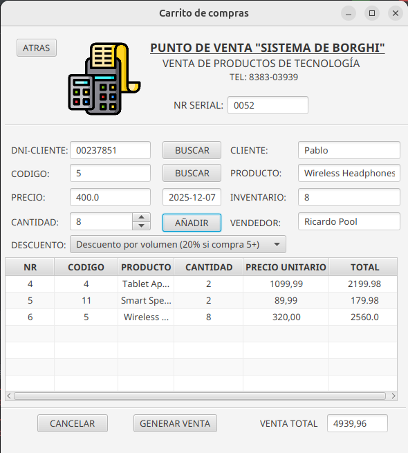
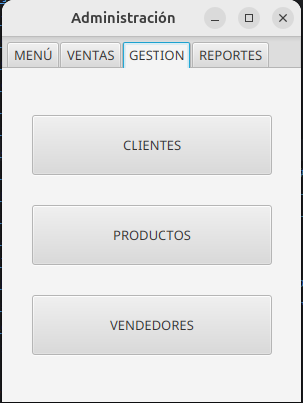
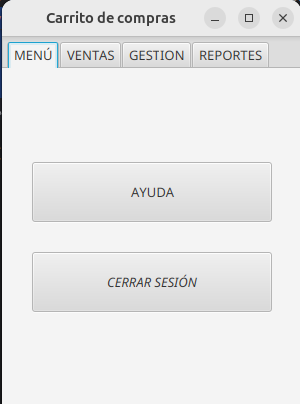
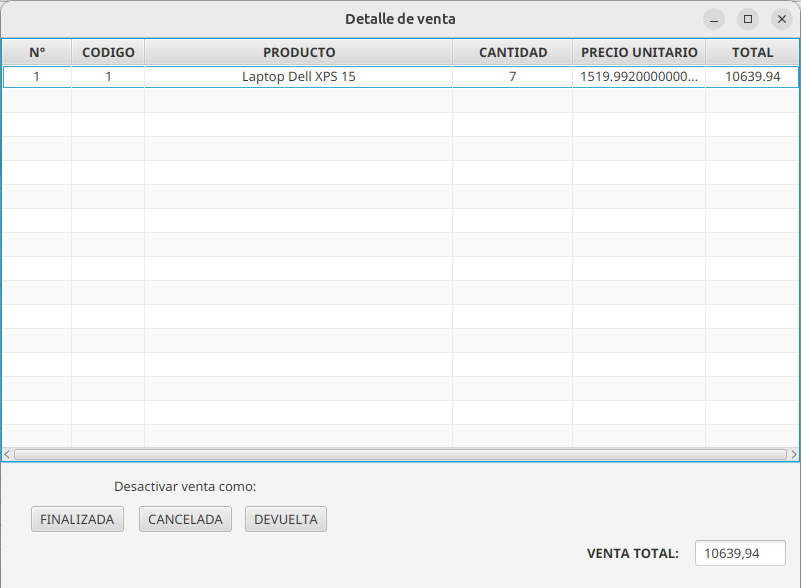

<h1 align="center" id="title">Sistema de ventas EQUIPO 11</h1>
<h6 align="center"> Propuesta de cambios constructivos para el sistema de ventas en JavaFX de Borghi. </h6>
<h1></h1>

<p align="center">
  
</p>

<!-- TOC -->
* [Antecedentes](#antecedentes)
* [Objetivo](#objetivo)
* [Mejoras visuales](#mejoras-visuales)
* [Errores corregidos](#errores-corregidos)
  * [Navegador web](#navegador-web)
  * [Formato de precios](#formato-de-precios)
  * [Nombre de pestañas](#nombre-de-pestañas)
* [Diagramas UML](#diagramas-uml)
* [Propuestas de mejora](#propuestas-de-mejora)
  * [Correo electronico y telefono de clientes](#correo-electronico-y-telefono-de-clientes)
  * [Descuentos en los productos](#descuentos-en-los-productos)
  * [Garantía en los productos](#garantía-en-los-productos)
  * [Desactivar ventas](#desactivar-ventas-)
* [Implementación](#implementación)
  * [Clase para descuentos](#clase-para-descuentos)
  * [Metodos para desactivar ventas](#metodos-para-desactivar-ventas)
* [Conclusión](#conclusión)
<!-- TOC -->

# Antecedentes
Este fue un ejercicio completado por estudiantes del lenguaje Java para poner en práctica los conocimientos aprendidos sobre el paradigma orientado a objetos.
Se hace uso de un software de codigo abierto bajo los derechos de uso del mismo. 

# Objetivo
Se hace una crítica constructiva al producto de Tomás Borghi bajo los conceptos de la programación orientada a objetos, se ofrecen mejoras a la interfaz visual y se proponen 4 nuevas funciones, implementando dos de ellas en este repositorio.
Un punto interesante es que este programa está hecho para Windows, pero nosotros estuvimos desarrollandolo en 2 Sistemas más: Linux y Mac para seguir la adaptabilidad de este software en distintos entornos, y comprobar la eficiencia de Java sobre otros leguajes de programación.

# Mejoras visuales
El cambio más significativo fue traducir los mensajes de la interfaz al español, algunas palabras fueron traducidas implicitamente, cambiandolas por un sinonimo que ayude al usuario a entender mejor las funciones.
Las palabras en español son más largas que en inglés, lo cual tuvo un efecto en los elementos visuales. Fueron acomodados y reorganizados en su mayoría.

<p align="center">
  
</p>

# Errores corregidos
Mientras se exploraba el programa se rastrearon 3 errores del codigo de los cuales nos hicimos a cargo de resolver. Se procede a su especificación.

## Navegador web
**- Sistema operativo: Linux Ubuntu.**
Existe una función predeterminada para consultar ayuda e información sobre el programa, el cual es un botón para navegar en el repositorio original de Borghi. Sin embargo, hace uso de los metodos de la clase Desktop, la cual está documentada oficialmente a fallar en este sistema. Como resultado: el programa se detiene y arroja un error de ejecución.
```
  public void help(ActionEvent actionEvent) {
        try {
            Desktop.getDesktop().browse(new URI("https://github.com/Borghii/Sales-System"));
        } catch (Exception e) {
            e.printStackTrace();
            setAlert(Alert.AlertType.ERROR,"The URL could not be opened. Check your internet connection.");
        }

    }
```
**Solucion:** Se decidió no usar esta clase para navegar y entonces usar un objeto ProcessBuilder para consultar la URL desde la terminal de cada computadora, este metodo está garantizado a ejecutarse siempre y cuando haya un navegador configurado en cada computadora.
```
    public void help(ActionEvent actionEvent) {
        try {
        String os = System.getProperty("os.name").toLowerCase();
        if (os.contains("win")) {
            new ProcessBuilder("rundll32", "url.dll,FileProtocolHandler", "https://github.com/Borghii/Sales-System").start();
        } else if (os.contains("mac")) {
            new ProcessBuilder("open", "https://github.com/Borghii/Sales-System").start();
        } else {
            new ProcessBuilder("xdg-open", "https://github.com/Borghii/Sales-System").start();
        }
    } catch (Exception e) {
        e.printStackTrace();
        setAlert(Alert.AlertType.ERROR, "No fue posible abrir la URL. Por favor, verifica tu conexión a internet.");
    }
   }
```
## Formato de precios

Los precios de los productos se guardan en la interfaz como atributos tipo TextField, y se tienen que pasar a datos primitivos para realizar operaciones con estos. La conversión de TextField a double es exitosa y este valor es reducido a dos decimales, sin embargo, en esta operación el punto separador entre enteros y decimales es cambiado por una coma, y al momento de querer convertir esto a un double el programa tira "NumberFormatException".
```
Double.parseDouble((total.getText())); // -> Anteriormente se ha regresado un valor a la interfaz que ya tiene una coma.
```
**Solucion:** Se decidió solamente cambiar manualmente la coma por el punto otra vez.
```
Double.parseDouble((total.getText()).replace(',','.'));
```

## Nombre de pestañas
El nombre de la pestaña del menu de administración se pierde y es reemplazado por el de las pestañas que se cerraron anteriormente.

<p align="center">
  
</p>

Esto solo es un detalle visual y pudo ser ignorado; sin embargo, aprovechamos a cambiar la usabilidad del software. Anteriormente, para cerrar el programa se debía cerrar todas las pestañas hasta llegar al inicio y entonces esa era la unica que podía terminar el programa.

**Solucion:** Se agrega una opción en todas las vistas para regresar al menú de administración, lo que garantíza que su nombre se actualize, entonces ahora cada pestaña termina el programa al cerrarse, manteniendo la lógica para el usuario.

# Diagramas UML
<p align="center">
  
</p>

# Propuestas de mejora
A continuación se presentan las cuatro propuestas de modificación al software, las cuales tienen el objetivo de mejorar la experiencia del usuario, así como recomendar mejoras a la estructura de codigo de Borghi.

## Correo electronico y telefono de clientes
Atributos nuevos de la clase Customer, esto permitiría la comunicación con el cliente de ser necesaria y el programa entonces podría enviar el recibo de compra al correo electronico.

## Descuentos en los productos
Una interfaz con la firma de algún metodo de descuento, y todos objetos Product deberían tener su propio tipo de descuento que se vea reflejado al momento de crear objetos tipo ShoppingCart.

## Garantía en los productos
Atributo nuevo de la clase Product, que marcaría ya sea una fecha o una cantidad de días en las que el Producto puede ser devuelto.

## Desactivar ventas 
En el programa el atributo "estado" de las ventas no tiene utilidad, se agregarían nuevos enums para este atributo y entonces agregar metodos para cambiar el estado de una venta.

# Implementación

Dos propuestas de las ya enlistadas se encuentran disponibles en este repositorio.

## Clase para descuentos
Mensajito aquí

## Metodos para desactivar ventas

Como se dijo antes, se trataría de nuevos enums de tipo 'state', los cuales son los siguientes:
- *'ACTIVE'*: La que ya existía, representa que la garantía aún no termina y la venta está sujeta a devolverse
- *'FINALIZADA'*: La garantía ha expirado y el negocio se libra de responsabilidad con el cliente.
- *'CANCELADA'*: La venta se canceló antes de entregarse.
- *'DEVUELTA'*: Ocurrió alguna avería de fábrica, o el cliente ya no la quiere.

Cada uno ahora representa el destino de la venta. Se modificaron la vista y el controlador 'SaleDetails', que es donde se añadió la función:

<p align="center">
  
</p>

Los metodos constan de dos consultas a la base de datos para obtener el estado del objeto, una para saber si ya se desactivó o está sujeta a desactivarse y otra para actualizar el estado.
```
    public void finalizar(javafx.event.ActionEvent actionEvent) {
        salesDAO.desactivar(idSale, Sales.State.FINALIZADA);
        if (parent != null) {
            parent.refreshReports();
        }
        closeCurrentStage(desactivar);
    }
    public void devolver(javafx.event.ActionEvent actionEvent){
        salesDAO.regresar(idSale, Sales.State.DEVUELTA,productsDetails);
        if (parent != null) {
            parent.refreshReports();
        }
        closeCurrentStage(desactivar);
    }
    public void cancelar(javafx.event.ActionEvent actionEvent){
        salesDAO.regresar(idSale, Sales.State.CANCELADA,productsDetails);
        if (parent != null) {
            parent.refreshReports();
        }
        closeCurrentStage(desactivar);
    }
```
Solo el cambio de estado a FINALIZAR usa solo estos pasos, el resto de estados usan un tercer metodo y conexion a la base de datos y es que se tienen que regresar los objetos que se pidieron al inventario.

Se logra obteniendo el codigo de un objeto tipo ShoppingCart, y con eso se llama a un metodo addStock() similar al metodo usado para descontar los productos al generar la venta, esto se hace por cada objeto en la venta.
```
    public void addStock(ObservableList<ShoppingCart> products){
        String sql = "UPDATE product SET stock = stock + ? WHERE idProduct = ?";
        try(Connection conn = DBConnection.connection()){

            for (ShoppingCart e:products) {
                try (PreparedStatement pstmt = conn.prepareStatement(sql)) {

                    pstmt.setInt(1,e.quantity());
                    pstmt.setInt(2,Integer.parseInt(e.cod()));
                    int rows_affected = pstmt.executeUpdate();

                    if (rows_affected>0){
                        System.out.println("productos regresados correctamente");
                    }else{
                        System.out.println("error regresando productos");
                    }
                }
            }
        }catch (SQLException e) {
            throw new RuntimeException(e);
        }
    }
```
Hubo un metodo más que fue necesario agregar -> ´refreshReports()´, y es que aparte que los estados se deben actualizar en la tabla de ventas, la gráfica de ventas totales no debería contar los productos que fueron devueltos. Hubo modificación de codigo en la inicialización de esta gráfica para esto, pero lo principal es que se añadió un metodo de refresco a la interfaz de reportes para que el usuario pueda ver los cambios en tiempo real a como se esperaría.
Este metodo recopila las funciones ya existentes para inicializar la interfaz de reportes, y configura la ejecucion dentro de "SalesDetail" para aplicar el refresco como si fuera la inicialización de la clase "Reports", esto implica que "SalesDetail" hereda los controles de "Reports".

# Conclusión

Se concluye el reporte de todo lo que trabajamos para el proyecto de la materia "Programación Orientada a Objetos". Hubo muchos aspectos que nos hubiera encantado trabajar, pero que fueron recortados para ajustar los tiempos a la entrega. Aun asi estamos satisfechos con el trabajo que se terminó y podemos asegurar que nos llevamos una buena experiencia de este y muchos aprendizajes base para continuar el estudio proximamente con los mismos temas pero abarcados en su maximo. Se agradece su atención de leer todo el reporte.

