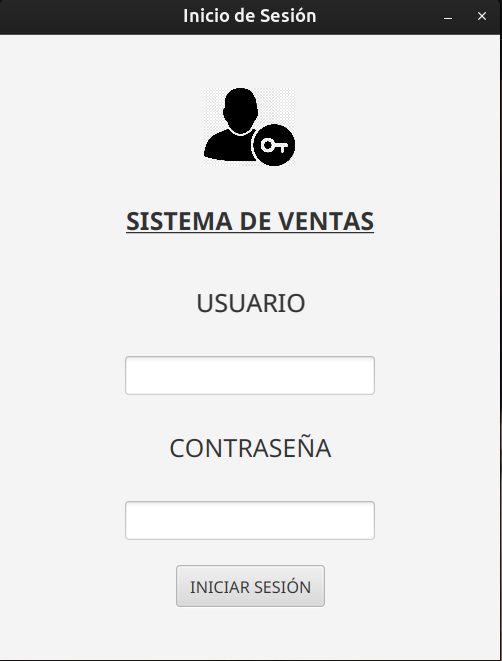
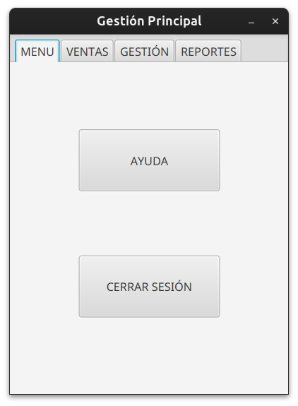
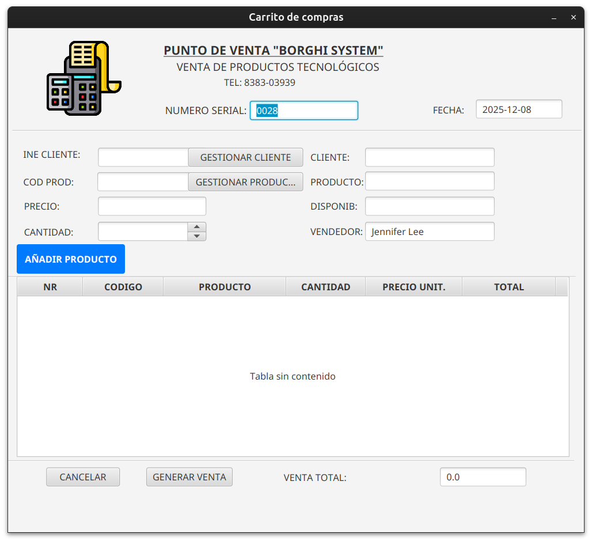
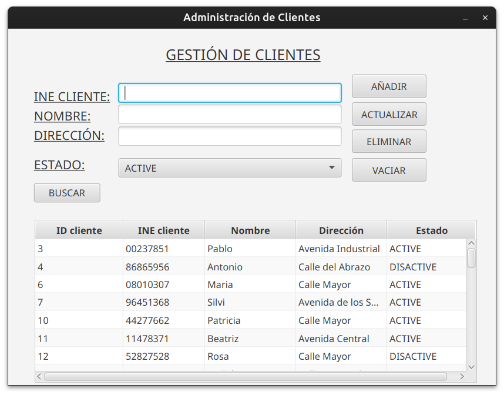
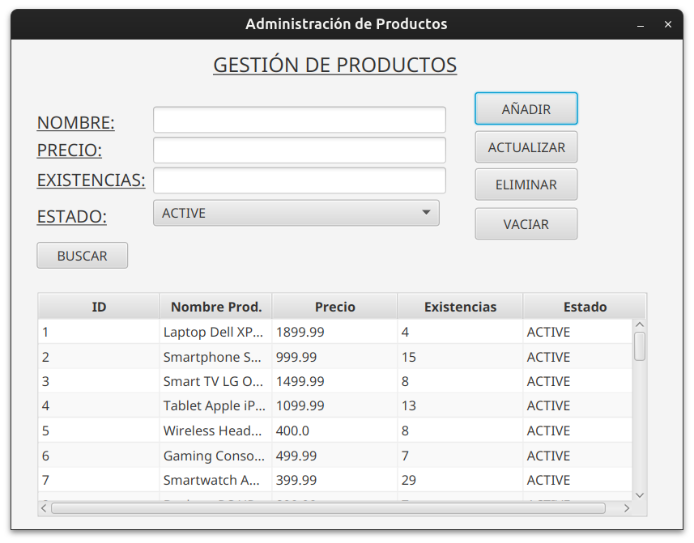
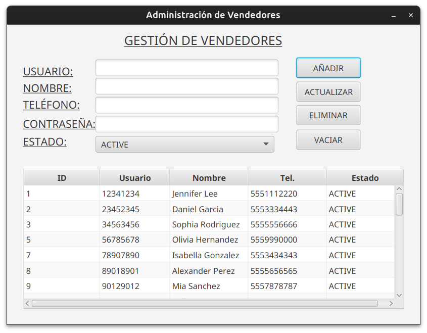
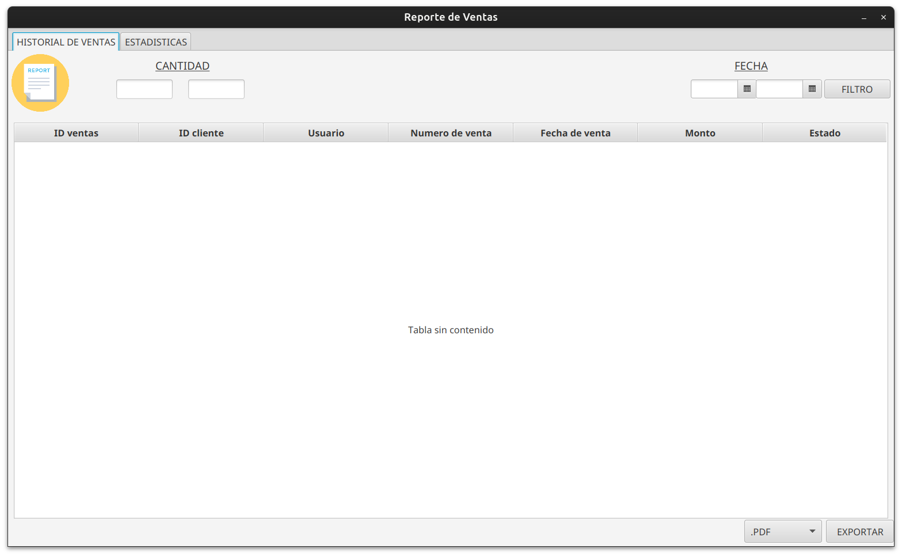
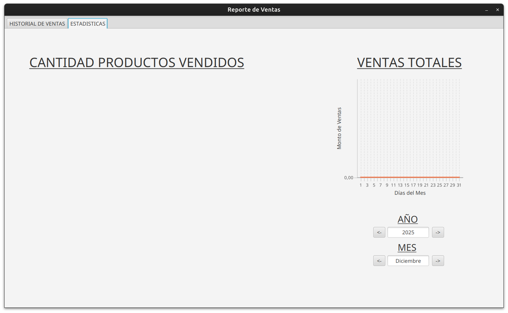

<h1 align="center" id="title"> Sistema de ventas en Java FX</h1>
<h6 align="center"> Aplicación de Gestión de Ventas con Java 17, JavaFX, MySQL y Patrones de Diseño MVC y DAO </h6>
<h1></h1>

  

<!-- TOC -->
* [📑 Descripcion](#-descripcion)
* [💻 Entorno](#-entorno)
* [🚀 Instalacion](#-instalacion)
    * [Instalacion del JDK 17](#instalación-del-jdk-17)
    * [Configuracion de la Base de Datos](#configuración-de-la-base-de-datos)
    * [Ejecucion del Proyecto](#ejecución-del-proyecto)
    * [Modificacion de las Vistas con Scene Builder](#modificación-de-las-vistas-con-scene-builder)
* [🧬 Estructura Basica](#-estructura-basica)
* [🗄️ Diagrama de Base de Datos](#-diagrama-de-base-de-datos)
* [💡 Fucionalidades](#-fucionalidades)
    * [Inicio de Sesion](#inicio-de-sesión)
    * [Pantalla Principal](#pantalla-principal)
        * [Sales](#sales)
        * [Management](#management)
        * [Reports](#reports)
* [📧 Contacto](#-contacto)
* [📝 Licencia](#-licencia)
<!-- TOC -->

# 📑 Descripcion
Este proyecto es una herramienta que diseñé para mejorar mis habilidades con el lenguaje Java, centrándome en la gestión de ventas para vendedores. Utiliza los patrones de diseño MVC (Modelo-Vista-Controlador) y DAO (Data Access Object) para una arquitectura robusta y modular.

Con esta aplicación, puedes iniciar sesión como vendedor, administrar tus productos y clientes, así como realizar ventas de manera sencilla. Además, cuenta con una sección de reportes donde puedes ver detalles de tus ventas, filtrarlas y generar informes personalizados.

Todos los datos se almacenan de forma segura en una base de datos MySQL, utilizando el patrón DAO para separar la lógica de acceso a datos de la lógica de negocio. Esto garantiza un código más limpio, mantenible y escalable.

Además, hay una sección de estadísticas que te muestra cuántas ventas has realizado de cada producto y cómo han variado a lo largo del tiempo, utilizando el patrón MVC para separar la lógica de presentación de la lógica de negocio y la manipulación de datos.

# 💻 Entorno

Este proyecto requiere las siguientes herramientas y versiones:

* SO: Windows  
* Java: 17 
* Maven: 3.8.5 
* MySQL: 8.0.33 
* JavaFX: 21

# 🚀 Instalacion
Para utilizar este proyecto, simplemente clona el repositorio en tu máquina local y sigue estos pasos:

## Instalación del JDK 17
Para ejecutar este proyecto, necesitarás tener instalado el JDK 17. Sigue estos pasos para instalarlo:

1. Descarga del JDK 17: Visita la página de descargas de Oracle JDK en https://www.oracle.com/java/technologies/javase-jdk17-downloads.html.
2. Selecciona tu sistema operativo: Descarga la versión adecuada del JDK 17 para tu sistema operativo. Asegúrate de seleccionar la versión correcta para Windows.
3. Instalación: Una vez descargado el archivo de instalación, sigue las instrucciones proporcionadas por Oracle para instalar el JDK 17 en tu sistema.
4. Configuración de las Variables de Entorno (Opcional): Después de instalar el JDK 17, puedes configurar las variables de entorno JAVA_HOME y PATH en tu sistema para que apunten al directorio de instalación del JDK. Esto facilitará el uso del JDK desde la línea de comandos.

## Configuración de la Base de Datos
Antes de ejecutar el proyecto, asegúrate de configurar la base de datos:

1. Instala MySQL: Si aún no tienes MySQL instalado, descárgalo e instálalo desde https://dev.mysql.com/downloads/mysql/.
2. Crea la Base de Datos: Utiliza el script proporcionado llamado salesystem.sql para importar la base de datos y las tablas necesarias.
3. Configura la Conexión: Para configurar la conexión a la base de datos, sigue estos pasos:
   * Crea un archivo llamado config.properties en la ruta src/main/java/org/borghisales/salessystem/model/.
   * Define las propiedades de configuración para la conexión a la base de datos en el archivo config.properties. 
   * Las propiedades necesarias son db.url, db.user y db.password. Por ejemplo:
   <pre>
   db.url=jdbc:mysql://localhost:3306/salesystem
   db.user=usuario
   db.password=contraseña
   </pre>
   
   Asegúrate de reemplazar nombre_basedatos, usuario y contraseña con los valores correspondientes de tu entorno de desarrollo.
## Ejecución del Proyecto
Una vez que hayas configurado la base de datos, puedes ejecutar el proyecto siguiendo estos pasos:

1. Clona el Proyecto: Clona este repositorio en tu máquina local utilizando Git o descargando el archivo ZIP.
2. Importa el Proyecto: Importa el proyecto en tu IDE preferido (como IntelliJ, Eclipse, etc.) como un proyecto Maven existente.
3. Verifica las Dependencias: Antes de compilar y ejecutar el proyecto, asegúrate de que todas las dependencias estén resueltas correctamente. Esto se puede hacer actualizando Maven o ejecutando el comando mvn clean install desde la línea de comandos en el directorio del proyecto. Esto garantizará que todas las dependencias se descarguen y configuren correctamente.
4. Compila y Ejecuta: Compila y ejecuta el proyecto desde tu IDE. Asegúrate de ejecutar la clase principal adecuada (si es necesario) para iniciar la aplicación.

## Modificación de las Vistas con Scene Builder
Si deseas modificar las vistas de la aplicación, puedes utilizar Scene Builder, una herramienta gráfica para diseñar interfaces de usuario JavaFX. Para instalar Scene Builder, sigue estos pasos:

1. Descarga Scene Builder: Puedes descargar Scene Builder desde el sitio web oficial de Gluon https://gluonhq.com/products/scene-builder/.
2. Instalación: Una vez descargado, sigue las instrucciones de instalación para tu sistema operativo.

# 🧬 Estructura Basica
<pre>
+ java
  |-- controllers // controladores de la aplicacion
  |-- model	// modelos de datos de la aplicación
  --Main.java // donde se inicia la ejecución del programa      
+ Resources
  |-- images // imágenes utilizadas en la aplicación
  |-- views // vistas de la aplicación fxml
  |-- reports // informes generados por la aplicación
</pre>

# 🗄️ Diagrama de Base de Datos

  

# 💡 Fucionalidades

## Inicio de sesión
Para iniciar sesión, se requiere el DNI y la contraseña del vendedor. En la base de datos, estos corresponden a los atributos del vendedor(seller), donde el DNI se asocia con 'dni' y la contraseña con 'user'.

  

## Pantalla principal
La pantalla principal muestra las siguientes ventanas
* Menu: incluyen la posibilidad de salir o visitar la documentación

  

* Sales: Permite generar nuevas ventas.

  

* Management: Ofrece operaciones CRUD (Crear, Leer, Actualizar, Eliminar) para clientes, productos y vendedores.

  

* Reports: Aquí se encuentran las operaciones de reportes y estadísticas relacionadas.

  

## Sales
https://github.com/Borghii/Sales-System/assets/137845283/60872beb-31af-47b0-b84d-83f9b4807ac5
## Management
https://github.com/Borghii/Sales-System/assets/137845283/4f85ec7c-f2de-44ae-815b-218c9ca25b10
## Reports
https://github.com/Borghii/Sales-System/assets/137845283/f85f1026-6693-4152-a793-6bfe02a8869f

# 📧 Contacto
Si tienes alguna pregunta, sugerencia o crítica sobre el proyecto, no dudes en contactarme por correo electrónico a [tomasborghi13@gmail.com](mailto:tomasborghi13@gmail.com).

# 📝 Licencia

Este proyecto está bajo licencia. Ver el archivo [LICENSE](LICENSE) para más detalles.

[⬆ Volver al inicio](#title) 

# *********************************************************

# AGREGAR DIAGRAMA UML

  

# 👷‍♀️ Errores encontrados al momento de ejecutar/compilar el proyecto y como se implemento una solución.

**1. Uno de los errores más notables era al oprimir el botón de "Help" este no interactuaba y además cerraba el programa despues de un lapso de tiempo de estar congelado, por su parte una solución fue entender que el proyecto al ser construido en Windows, debía de existir una implementación para LINUX.**
   
*La solución fue crear un nuevo proceso del OS el cual ejecuta un comando de linux "xdg-open", solucionando de una manera el problema y no afectando directamente al proyecto.*
  
**2. El segundo error se ecnontraba en el carrito de compras y también al momento de generar ventas, no permitía añadir productos al carrito para la generar venta(y una vez solucionado, tampoco dejaba generar venta),  el error en ambos casos era ocasionado por que se intentaba hacer un parseDouble a un String con un formato no valido para los doubles(utilizaba comas en vez de puntos), formato devuelto por el metodo format.String.**

*La solución fue quitarlo y operar con todos los decimales, unicammente lo truncabamos a dos decimales para lo visual, y la verdadera causante se debe a la configuración de idioma del usuario, si lo tienes en español, el formatString retornaba xx,xx si lo tenías en otro idioma como inglés, retornaba el mismo metódo xx.xx (ya legible por el parceDouble)*

**3. Un tercer error solucionado era el problema de maximizar ventanas, este aunque estuviera de una manera para generarla de acuerdo al contenido, solo minizaba la pestaña al minimo y uno tenía que redimensionar, bueno.**
   
*La solución fue implementar un nuevo método que aplique a las ventanas de la interfaz un aumento adecuado, se elimino el anterior y se empleo en su totalidad este último, además se implemento que el usuario no pueda extender o en si maximizar las ventanas para evitar desperfecciones o una interfaz descuadrada.*

**4. Hay un error visual con el título de ciertas pestañas que al regresar a la pestaña anterior este se mantiene.**
   
*La Solución fue Crear un Map que asociaba el archivo FXML con el titulo que debía mostrar la ventana. Luego configure en el método configureStageCloseEvent que pueda abrir la ventana padre con el título correcto al cerrar la ventana secundaria.*

# 👨‍🔬 Propuestas de mejoras en funcionalidad para el proyecto

## Un Botón de busqueda
  Una función que facilitaría la busqueda de información, especificamente sobre los clientes y productos.  Esta funcionalidad optimizaría la experiencia del usuario al permitir la localización eficiente de registros dentro de grandes volúmenes, en este caso entre los clientes y los productos, aplicando filtros sobre los registros, 

## Seguridad para los Vendedores
  En la administracón de vendedores resulta muy fácil eliminar/actualizar los vendedores, ya que no hay ninguna restricción para ello, esta viene siendo una función bastante peligrosa y muy malograda, ya que al borrar/actualizar al vendedor sin su consentimiento puedes perjudicarlo obviamente, sobre todo por que los reportes son individuales. Entonces se propondría que al momento de eliminarlo/actualizar al vendedor con la sesión activa se le pida permisos, como la constaseña del vendedor, ya que esta no debería ser (sí lo es) visible para otros, podría mejorarse pero complicaría mucho las cosas, por lo que por el momento con pedir la constraseña del usuario basta.

## Botones para obtener un cliente y/o producto desde el Carrito
  Esto es algo que podría parecer muy poco útil pero es todo lo contrario, una vez consultado con personas encargadas de pequeñas tiendas, veiamos que algunos softwares de uso libre no incluyen una función para ir directo desde el carrito a obtener los datos del producto o cliente, esto ahorra tiempo, es eficaz y a su vez es muy viable, esto permite eliminar los botones de añadir o buscar y solo ir a las pestañas correspondientes

## Poder eliminar ventas ya realizadas y devolver el stock al inventario dependiendo del objeto.
  Muchas veces podemos equivocarnos y queremos regresar para poder evitar colocar algo mal o devolver un producto, esta implementación se encarga de evitarnos problemas, al dar clic sobre una venta realizada podemos consultar sus detalles o eliminar, al dar clic en eliminar se nos cerciora si estamos de acuerdo, al dar clic se da una notificación de venta eliminada y stock retornado al inventario

# ✔️ Propuestas implementadas

<h2>Botón de búsqueda</h2> 

_**¿Cómo se realizo?**_ Para este se aplicó la clase FilteredList. Esta estructura actúa como una máscara dinámica sobre la lista observable original, para no tener que estar accediendo a la base de datos y usar consultas para filtrar elementos de esta constantemente. Con el FilteredList actuamos sobre la clase ObservableList, que esta sí es cargada con el contenido de la base de datos correspondiente. 
    
_**¿Cuál es la relación con POO?**_ Con respecto a la POO, se aplicaron las lambdas que son útiles para tener un código limpio, compacto y para implementar polimorfismo por medio de interfaces funcionales (un solo método abstracto), además de implementar encapsulación con métodos y atributos en privado, para que otras clases no puedan acceder a estas funciones y malograr el funcionamiento.
    
<h2>Seguridad para los Vendedores</h2> 

_**¿Cómo se realizo?**_ Para la seguridad de los vendedores se implementó una forma de validación usando directamente  el objeto en memoria this.seller, evitandonos la lógica de los campos de texto editables de la interfaz. Esta garantiza que las operaciones de eliminación y actualización se ejecuten unicamente sobre la entidad seleccionada en la tabla, y no por los valores que el usuario ponga en los TextField, evitando que cualquiera penetre la seguridad para el vendedor. 
    
_**¿Cuál es la relación con POO?**_ Con respecto a la POO, se destacó el  Encapsulamiento y la separación entre la Vista y el Modelo, asegurando que la validación de las contraseña se realice comparando contra el estado inmutable del objeto encapsulado y no contra la entrada visual, protegiendo así la consistencia de la base de datos.

<h2>Botones para obtener un cliente y/o producto desde el Carrito</h2> 

_**¿Cómo se realizo?**_ Se logro implementar en el punto de venta una opción para seleccionar directamente un cliente o producto desde el carrito, sin la necesidad de buscarlos manualmente en otra ventana. Esto se pudo lograr gracias a la implementación de botones que abren una ventana modal para gestionar tanto clientes como productos, donde al seleccionar un elemento se envía de manera automática al controlador de ventas mediante una interfaz genérica (SelectionListener), actualizando así los campos correspondiente y cerrando la ventana. Por otra parte se mejoró la búsqueda en tiempo real así como la deselección de opciones para hacer la experiencia de una manera más ágil.
    
_**¿Cuál es la relación con POO?**_ En cuanto a la relación con POO en esta implementación se pudo ver reflejado en que se usan objetos (clientes y productos), donde a su vez se aplica el encapsulamiento al manejar los datos mediante los DAOs y/o controladores. Por otra parte vemos presente polimorfismo y abstracción en la interfaz genérica "SelectionListener" creada y que permite que la misma lógica maneje distintos tipos de objetos sin la necesidad de duplicar código. 

<h2>Poder eliminar ventas ya realizadas </h2> 

_**¿Cómo se realizo?**_ Se implemento una funcionalidad para eliminar ventas ya registradas desde la interfaz de reportes. Logrando esto al hacer doble clic sobre una venta ya realizada (resumen) donde se despliega un cuadro de diálogo que nos permite ver tanto los detalles de la venta, así como incluso eliminarla. Si se selecciona eliminar, el sistema solicita una confirmación; al aceptar, se ejecuta la eliminación correspondiente de la venta desde la Base de Datos, notificando así al usuario sobre la acción.

_**¿Cuál es la relación con POO?**_ En este caso su relación con POO se refleja en la estructura de la implementación; donde se usan objetos Sales para poder representar de alguna manera las ventas, por otra parte se encapsula la lógica de acceso a los datos en la clase SalesDAO, y también los controladores (ReportsController y SaleDetailController) logran manejar la interacción con la interfaz y las operaciones sobre los objetos de una manera eficaz y organizada. Esto nos permite que cada clase tenga en si responsabilidades, facilite la reutilización del código e incluso mantenga la lógica modular así como escalable.

# 💡 Fucionalidades

## Implementación Inicio de sesión.
  Para el inicio de sesión la persona (vendedor) requiere de un usuario (INE Usuario), el cual desde la base de datos podemos verlo relacionado con el "dni", mientras que para la contraseña se emplea el "user"

  

## Menú Principal.
  Desde este punto el usuario puede acceder a las ventanas de Menu, Ventas, Gestión y Reportes. La interfaz no ha sido modificado tanto para este apartado, solo se ha mantenido una visibilidad correcta, pero es eficiente y útil que es lo que se busca.

  

## Carrito de Compras.
  Se accede a él desde el apartado de Generar una venta, se ha modificado para que el cliente no tenga la necesidad de recordar el código, nombre, etc. Para eso se implementa una función la cual ya realiza todo el proceso de buscar y colocar el cliente/producto, la interfaz se vuelve muy intuitiva y eficiente.

  

## Administración De Clientes.
  Es un apartado donde el usuario podra desde agregar, actualizar o eliminar lo relacionado con un cliente, a su vez se implementa un botón para buscar referente a un Nombre/ID/INE, haciendo que obtenga una facilidad de uso (sea más accesible)

  

## Administración De Productos.
  Apartado donde el usuario puede añadir, actualizar o eliminar productos, a su vez se implemento un botón similar para poder buscar un objeto específico 

  

## Administración De Vendedores.
  Apartado donde el usuario puede añadir, actualizar o eliminar vendedores,modificando asi sus datos, para realizar cambios con la eliminación de alguno, se requiere de una seguridad extra (la contraseña del vendedor).

  

## Reporte de Ventas.
  Apartado donde el consultar las ventas realizadas, ver los detalles, consultar los graficos respecto al mes y a su vez obtener la posibilidad de eliminar ventas ya realizadas.

  

  

# AGREGAR COMO COMPILAR, FUNCIONA?, COMO CORRERLO, INSTALAR MVN, CREAR CON DEPENDENCIAS, ETC.
# AGREGAR VIDEO
# AGREGAR MODIFICACIONES EN INTERFAZ.
    
