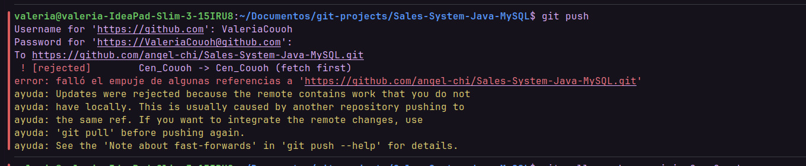

<h1 align="center" id="title"> Sistema de ventas en Java FX</h1>
<h6 align="center"> Aplicación de Gestión de Ventas con Java 17, JavaFX, MySQL y Patrones de Diseño MVC y DAO </h6>
<h1></h1>

<!-- TOC -->
* [📑 Descripcion](#-descripcion)
* [💻 Entorno](#-entorno)
* [🚀 Instalacion](#-instalacion)
    * [Instalacion del JDK 17](#instalación-del-jdk-17)
    * [Configuracion de la Base de Datos](#configuración-de-la-base-de-datos)
    * [Ejecucion del Proyecto](#ejecución-del-proyecto)
    * [Modificacion de las Vistas con Scene Builder](#modificación-de-las-vistas-con-scene-builder)
* [🧬 Estructura Basica](#-estructura-basica)
* [🗄️ Diagrama de Base de Datos](#-diagrama-de-base-de-datos)
* [💡 Fucionalidades](#-fucionalidades)
    * [Inicio de Sesion](#inicio-de-sesión)
    * [Pantalla Principal](#pantalla-principal)
        * [Sales](#sales)
        * [Management](#management)
        * [Reports](#reports)
* [📧 Contacto](#-contacto)
* [📝 Licencia](#-licencia)
* [📊 Diagrama UML](#Diagrama-UML)
* [❌ Identificación de errores](#identificación-de-errores)
  * [Error 1. Error con la base de datos](#Error-con-la-base-de-datos)
  * [Error 2. Problemas al hacer Git Push](#Problemas-al-hacer-Git-Push)
* [👨🏻‍🔧 Mejoras propuestas](#-cambios-propuestos)
  * [1. Clasificación por marca](#cambio-1-clasificación-por-marca)
  * [2. Modelar el tipo de venta](#cambio-2-modelar-el-tipo-de-venta)
  * [3. Crear una clase para el inventario](#cambio-3-crear-una-clase-para-el-inventario)
  * [4. Crear un manejo de diferentes tipos de pago](#cambio-4-crear-un-manejo-de-diferentes-tipos-de-pago)
* [🎥 Video de Presentación](#Video-de-Presentación)
<!-- TOC -->

# 📑 Descripcion
Este proyecto surge como parte de nuestro proceso de aprendizaje de Java y Programación Orientada a Objetos, con la idea de construir algo más real que solo ejercicios: un pequeño sistema de ventas que pueda gestionar productos, clientes y vendedores. Más que solo “que funcione”, lo usamos para practicar cosas que sí se aplican en proyectos serios: **separación por capas, trabajo con base de datos y organización del código.**

A lo largo del desarrollo buscamos aplicar POO, el patrón MVC para organizar la lógica, las vistas y los modelos; y un manejo más ordenado del acceso a datos usando clases específicas para comunicarnos con la base de datos. También aprovechamos el proyecto para practicar herramientas de la vida real como Git/GitHub, trabajo en equipo, revisión de código y documentación, entre otros aspectos.

En resumen, este proyecto no solo es una aplicación para gestionar ventas, sino también un laboratorio donde experimentamis y pusimos en práctica diseño de software, colaboración y lo aprendido a lo largo de este semestre, todas estas son cosas que nos van a servir en proyectos más grandes y profesionales.

# 💻 Entorno

Este proyecto requiere las siguientes herramientas y versiones:

* SO: Windows  
* Java: 17 
* Maven: 3.8.5 
* MySQL: 8.0.33 
* JavaFX: 21

# 🚀 Instalacion
Para utilizar este proyecto, simplemente clona el repositorio en tu máquina local y sigue estos pasos:

## Instalación del JDK 17
Para ejecutar este proyecto, necesitarás tener instalado el JDK 17. Sigue estos pasos para instalarlo:

1. Descarga del JDK 17: Visita la página de descargas de Oracle JDK en https://www.oracle.com/java/technologies/javase-jdk17-downloads.html.
2. Selecciona tu sistema operativo: Descarga la versión adecuada del JDK 17 para tu sistema operativo. Asegúrate de seleccionar la versión correcta para Windows.
3. Instalación: Una vez descargado el archivo de instalación, sigue las instrucciones proporcionadas por Oracle para instalar el JDK 17 en tu sistema.
4. Configuración de las Variables de Entorno (Opcional): Después de instalar el JDK 17, puedes configurar las variables de entorno JAVA_HOME y PATH en tu sistema para que apunten al directorio de instalación del JDK. Esto facilitará el uso del JDK desde la línea de comandos.

## Configuración de la Base de Datos
Antes de ejecutar el proyecto, asegúrate de configurar la base de datos:

1. Instala MySQL: Si aún no tienes MySQL instalado, descárgalo e instálalo desde https://dev.mysql.com/downloads/mysql/.
2. Crea la Base de Datos: Utiliza el script proporcionado llamado salesystem.sql para importar la base de datos y las tablas necesarias.
3. Configura la Conexión: Para configurar la conexión a la base de datos, sigue estos pasos:
   * Crea un archivo llamado config.properties en la ruta src/main/java/org/borghisales/salessystem/model/.
   * Define las propiedades de configuración para la conexión a la base de datos en el archivo config.properties. 
   * Las propiedades necesarias son db.url, db.user y db.password. Por ejemplo:
   <pre>
   db.url=jdbc:mysql://localhost:3306/salesystem
   db.user=usuario
   db.password=contraseña
   </pre>
   
   Asegúrate de reemplazar nombre_basedatos, usuario y contraseña con los valores correspondientes de tu entorno de desarrollo.
## Ejecución del Proyecto
Una vez que hayas configurado la base de datos, puedes ejecutar el proyecto siguiendo estos pasos:

1. Clona el Proyecto: Clona este repositorio en tu máquina local utilizando Git o descargando el archivo ZIP.
2. Importa el Proyecto: Importa el proyecto en tu IDE preferido (como IntelliJ, Eclipse, etc.) como un proyecto Maven existente.
3. Verifica las Dependencias: Antes de compilar y ejecutar el proyecto, asegúrate de que todas las dependencias estén resueltas correctamente. Esto se puede hacer actualizando Maven o ejecutando el comando mvn clean install desde la línea de comandos en el directorio del proyecto. Esto garantizará que todas las dependencias se descarguen y configuren correctamente.
4. Compila y Ejecuta: Compila y ejecuta el proyecto desde tu IDE. Asegúrate de ejecutar la clase principal adecuada (si es necesario) para iniciar la aplicación.

## Modificación de las Vistas con Scene Builder
Si deseas modificar las vistas de la aplicación, puedes utilizar Scene Builder, una herramienta gráfica para diseñar interfaces de usuario JavaFX. Para instalar Scene Builder, sigue estos pasos:

1. Descarga Scene Builder: Puedes descargar Scene Builder desde el sitio web oficial de Gluon https://gluonhq.com/products/scene-builder/.
2. Instalación: Una vez descargado, sigue las instrucciones de instalación para tu sistema operativo.

# 🧬 Estructura Basica
<pre>
+ java
  |-- controllers // controladores de la aplicacion
  |-- model	// modelos de datos de la aplicación
  --Main.java // donde se inicia la ejecución del programa      
+ Resources
  |-- images // imágenes utilizadas en la aplicación
  |-- views // vistas de la aplicación fxml
  |-- reports // informes generados por la aplicación
</pre>

# 🗄️ Diagrama de Base de Datos

  

# 💡 Fucionalidades

## Inicio de sesión
Para iniciar sesión, se requiere el DNI y la contraseña del vendedor. En la base de datos, estos corresponden a los atributos del vendedor(seller), donde el DNI se asocia con 'dni' y la contraseña con 'user'.

  

## Pantalla principal
La pantalla principal muestra las siguientes ventanas
* Menu: incluyen la posibilidad de salir o visitar la documentación

  

* Sales: Permite generar nuevas ventas.

  

* Management: Ofrece operaciones CRUD (Crear, Leer, Actualizar, Eliminar) para clientes, productos y vendedores.

  

* Reports: Aquí se encuentran las operaciones de reportes y estadísticas relacionadas.

  

## Sales
https://github.com/Borghii/Sales-System/assets/137845283/60872beb-31af-47b0-b84d-83f9b4807ac5
## Management
https://github.com/Borghii/Sales-System/assets/137845283/4f85ec7c-f2de-44ae-815b-218c9ca25b10
## Reports
https://github.com/Borghii/Sales-System/assets/137845283/f85f1026-6693-4152-a793-6bfe02a8869f

# 📧 Contacto
Si tienes alguna pregunta, sugerencia o crítica sobre el proyecto, no dudes en contactarme por correo electrónico a [tomasborghi13@gmail.com](mailto:tomasborghi13@gmail.com).

# 📝 Licencia

Este proyecto está bajo licencia. Ver el archivo [LICENSE](LICENSE) para más detalles.

# Diagrama UML

# Identificación de Errores
## Error con la base de datos

Al intentar compilar el programa. surgió una excepción que indicada que MySQL no encontró la tabla "products" en la base
de datos a la que se encuentra conectada el proyecto, que en nuestro caso es "salesystem".  
El error se solucionó revisando la base de datos y verificando si la tabla existía, el problema era que el script de la 
base de datos no había sido importado de forma correcta, por lo que se realizó paso a paso este proceso de nuevo y ahora
todo funcionaba bien.
## Problemas al hacer Git Push

Git rechazó el git push porque en la rama en que trabajamos remotamente (Cen_Couoh) tenía commits que no existían en mi copia local.
En pocas palabras, tenía commits nuevos locales, pero mi compañero ya había subido cambios a la misma rama en GitHub antes de mi push.
Para evitar perder el trabajo de la otra persona, Git no permite subir directamente y pide primero que se haga un pull.
En este caso, para solucionar el problema se realizó lo siguiente:
* Revisar el estado de la rama con *git push*.
* Limpiar los cambios irrelevantes que del IDE con un *git restore*
* Hacer un *git pull.rebase false*, de esta forma no se modifican ni borran los commits, simplemente se decide
  de que forma se combinan.
* Ahora seleccionamos la rama con un *git checkout Cen_Couoh*
* Después hacemos *git pull* (De esta forma Git detectó que las ramas divergieron y realizó un merge entre los commits locales y los que estaban en
  GitHub)
* Finalmente hacemos el *git push origin Cen_Couoh* y el git push es aceptado porque el historial de commits está alineado

## Código
### Tabla de gestión de Product
Este error fue causado por nosostros pues ocurrió después de agregar el atributo **Brand** y evitaba que se vieran los productos en la gestión de estos. 
Pues, la tabla product solo guardaba el ID de la marca (idBrand), pero no el nombre. 
Entonces el _ProductDAO_ hacía un _SELECT * FROM product_. Al intentar crear el objeto en Java, el sistema buscaba la columna _"brand_name"_, no la encontraba, fallaba construir el objeto y devolvía null.
 **Solución:** Modificamos la consulta SQL en el ProductDAO para utilizar un _INNER JOIN_ .

Consecuencia en UI: El controlador recibía un null, asumía que el producto no existía y lanzaba la alerta, dejando el selector de cantidad (Spinner) bloqueado.
### Botón "Ayuda"
Un error que se detectó fue que cuando se presionaba el botón de "Help" no ocurría nada Originalmente, el código probablemente intentaba usar _Desktop.getDesktop().browse(new URI("https://github.com/Borghii/Sales-System"))_. 
Y esa línea está muy optimizada para Windows y MacOS. Sin embargo en Linux, Java a menudo no logra comunicarse correctamente con el gestor de ventanas para saber cuál es el navegador predeterminado.
 **Solución:** Se utilizó _System.getProperty_ para que detecte el navegador predeterminado y así logramos que ese error desapareciera.

# Cambios propuestos
## Cambio 1. Clasificación por marca
### Descripción del cambio

Se implementará un nuevo apartado para **Product**, este será el apartado **brand** para gestionar las marcas de los productos y que se puedan clasificar por esa caracteristica.  
Se creará una nueva entidad Brand (reflejada en la base de datos sql como una tabla independiente) y se relacionará de manera directa en la tabla product mediante una **_Foreign Key_**.  
El proposito de esto es que, al registrar o editar un producto, la marca se seleccione desde un catálogo dinámico cargado desde la base de datos, en lugar de ingresarse como texto libre, 
facilitando el proceso y evitando el "error humano" o la creación de marcas inexistentes. 

### Justificación 
Desde el punto de vista de la Programación Orientada a Objetos (POO), la implementación de la clase **_Brand_** como atributo de **_Product_** es lógico debido a que: 
1. En lugar de tratar la marca como un tipo de dato primitivo (String), se eleva a la categoría de Objeto, pues en el mundo real, una "Marca" es una entidad con identidad propia (un ID) y atributos (un nombre). Al crear la clase **_Brand_**, se refleja de mejor manera el modelo de negocio, permitiendo interactuar con atributos concretos en lugar de datos sueltos.
2. De igual manera, entra la **escalabilidad** pues en el mundo real no existe un numero finito y determinado de marcas, por lo que si llega una nueva es tan sencillo como agregarla a la **base de datos** y el cambio se verá reflejado.
3. Esto facilita futuras expansiones, como generar reportes de ventas filtrados específicamente por el ID de una marca o gestionar atributos adicionales del fabricante sin afectar la estructura del producto.

## Cambio 2. Modelar el tipo de venta
### Descripción del cambio
En este cambio se propone ampliar la clase Sales para que, además de la información básica de la venta (id del cliente, id del vendedor, fecha, monto y estado), también guarde el tipo de venta que se realizó.
Para eso se agrega un nuevo atributo llamado **Type**, a _Sales_, de tipo **_TipoDeVenta_**, donde TipoDeVenta es un enum definido con dos valores: EN_TIENDA (venta física) y
EN_LINEA (venta en línea).

### Justificación
Este cambio busca que el sistema entienda explícitamente qué tipo de venta se está registrando, en lugar de tratar todas las ventas igual o depender de cadenas de texto. 
Al guardar el tipo de venta dentro de la clase Sales, se vuelve mucho más sencillo diferenciar entre ventas físicas y en línea, así como en caso de requerirlo, aplicar reglas distintas 
según el tipo de venta (promociones, descuentos, etc.) 
Desde la Programación Orientada a Objetos, la implementación del tipo de venta mediante un enum representa una ventaja porque pertenece al modelo del dominio. Esta práctica centraliza la
clasificación de las ventas (EN_TIENDA/EN_LINEA), ofreciendo mayor seguridad de datos y claridad de código. 
Además, la estructura garantiza que los nuevos canales de venta solo requieran la adición de nuevos valores al enum, sin alterar la clase Sales directamente.

## Cambio 3. Crear una clase para el Inventario 
### Descripción del cambio
En el programa actual, la validación y actualización del stock de los productos (por ejemplo, verificar si hay suficientes unidades para una venta o descontar el stock cuando se completa la compra) suele hacerse directamente 
en los controladores o en código disperso. La propuesta es agrupar toda esa lógica en una clase específica. Esta clase se encargará de verificar si hay stock suficiente de un producto, descontar stock cuando se realiza una venta,
aumentar stock en caso de devoluciones o correcciones y consultar el stock actual desde la base de datos.
### Justificación
Esta mejora apunta a que la lógica relacionada con el stock deje de estar regada en varios controladores y pase a estar encapsulada en una sola clase, que entiende y controla todo lo que tiene que ver con existencias.

## Cambio 4. Crear un manejo de diferentes tipos de pago
### Descripción del cambio
La idea es crear una superclase **"Pago"**, que represente un pago genérico, y luego crear subclases para cada tipo de pago que maneje el sistema,
por ejemplo:
* CashPayment → pago en efectivo
* CardPayment → pago con tarjeta
### Justificación
Vemo que cada forma de pago se vuelve una clase con su propia lógica. Por ejemplo, el pago en efectivo es simple, pero el pago con tarjeta podría requerir validaciones extra,
datos adicionales (número de autorización, últimos dígitos, etc.). Viendo el panorama desde la Programación Orientada a Objetos, la adición de Payment mejora el programa al
hacer que la gestión de los pagos sea modular y fácil de extender, aplicando de esta forma el polimorfismo, al mismo tiempo que mantiene la lógica específica de cada pago aislada y protegida, 
poniendo en prática le encapsulación y la abstracción.

[⬆ Volver al inicio](#title) 
