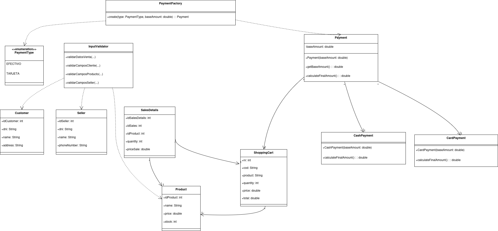

<h1 align="center" id="title"> Sistema de ventas en Java FX</h1>
<h6 align="center"> Aplicación de Gestión de Ventas con Java 17, JavaFX, MySQL y Patrones de Diseño MVC y DAO </h6>
<h1></h1>

[](https://opensource.org/licenses/MIT)

<p align="center">
  
</p>

<!-- TOC -->
* [📑 Descripcion](#-descripcion)
* [💻 Entorno](#-entorno)
* [🚀 Instalacion](#-instalacion)
    * [Instalacion del JDK 17](#instalación-del-jdk-17)
    * [Configuracion de la Base de Datos](#configuración-de-la-base-de-datos)
    * [Ejecucion del Proyecto](#ejecución-del-proyecto)
    * [Modificacion de las Vistas con Scene Builder](#modificación-de-las-vistas-con-scene-builder)
* [🧬 Estructura Basica](#-estructura-basica)
* [🗄️ Diagrama de Base de Datos](#-diagrama-de-base-de-datos)
* [💡 Fucionalidades](#-fucionalidades)
    * [Inicio de Sesion](#inicio-de-sesión)
    * [Pantalla Principal](#pantalla-principal)
        * [Sales](#sales)
        * [Management](#management)
        * [Reports](#reports)
* [📧 Contacto](#-contacto)
* [📝 Licencia](#-licencia)
<!-- TOC -->

# 📑 Descripcion
Este proyecto es una herramienta que diseñé para mejorar mis habilidades con el lenguaje Java, centrándome en la gestión de ventas para vendedores. Utiliza los patrones de diseño MVC (Modelo-Vista-Controlador) y DAO (Data Access Object) para una arquitectura robusta y modular.

Con esta aplicación, puedes iniciar sesión como vendedor, administrar tus productos y clientes, así como realizar ventas de manera sencilla. Además, cuenta con una sección de reportes donde puedes ver detalles de tus ventas, filtrarlas y generar informes personalizados.

Todos los datos se almacenan de forma segura en una base de datos MySQL, utilizando el patrón DAO para separar la lógica de acceso a datos de la lógica de negocio. Esto garantiza un código más limpio, mantenible y escalable.

Además, hay una sección de estadísticas que te muestra cuántas ventas has realizado de cada producto y cómo han variado a lo largo del tiempo, utilizando el patrón MVC para separar la lógica de presentación de la lógica de negocio y la manipulación de datos.

# 💻 Entorno

Este proyecto requiere las siguientes herramientas y versiones:

* SO: Windows <br> 
* Java: 17<br>
* Maven: 3.8.5<br>
* MySQL: 8.0.33<br>
* JavaFX: 21


# 🚀 Instalacion
Para utilizar este proyecto, simplemente clona el repositorio en tu máquina local y sigue estos pasos:

## Instalación del JDK 17
Para ejecutar este proyecto, necesitarás tener instalado el JDK 17. Sigue estos pasos para instalarlo:

1. Descarga del JDK 17: Visita la página de descargas de Oracle JDK en https://www.oracle.com/java/technologies/javase-jdk17-downloads.html.
2. Selecciona tu sistema operativo: Descarga la versión adecuada del JDK 17 para tu sistema operativo. Asegúrate de seleccionar la versión correcta para Windows.
3. Instalación: Una vez descargado el archivo de instalación, sigue las instrucciones proporcionadas por Oracle para instalar el JDK 17 en tu sistema.
4. Configuración de las Variables de Entorno (Opcional): Después de instalar el JDK 17, puedes configurar las variables de entorno JAVA_HOME y PATH en tu sistema para que apunten al directorio de instalación del JDK. Esto facilitará el uso del JDK desde la línea de comandos.

## Configuración de la Base de Datos
Antes de ejecutar el proyecto, asegúrate de configurar la base de datos:

1. Instala MySQL: Si aún no tienes MySQL instalado, descárgalo e instálalo desde https://dev.mysql.com/downloads/mysql/.
2. Crea la Base de Datos: Utiliza el script proporcionado llamado salesystem.sql para importar la base de datos y las tablas necesarias.
3. Configura la Conexión: Para configurar la conexión a la base de datos, sigue estos pasos:
   * Crea un archivo llamado config.properties en la ruta src/main/java/org/borghisales/salessystem/model/.
   * Define las propiedades de configuración para la conexión a la base de datos en el archivo config.properties. 
   * Las propiedades necesarias son db.url, db.user y db.password. Por ejemplo:
   <pre>
   db.url=jdbc:mysql://localhost:3306/salesystem
   db.user=usuario
   db.password=contraseña
   </pre>
   
   Asegúrate de reemplazar nombre_basedatos, usuario y contraseña con los valores correspondientes de tu entorno de desarrollo.
## Ejecución del Proyecto
Una vez que hayas configurado la base de datos, puedes ejecutar el proyecto siguiendo estos pasos:

1. Clona el Proyecto: Clona este repositorio en tu máquina local utilizando Git o descargando el archivo ZIP.
2. Importa el Proyecto: Importa el proyecto en tu IDE preferido (como IntelliJ, Eclipse, etc.) como un proyecto Maven existente.
3. Verifica las Dependencias: Antes de compilar y ejecutar el proyecto, asegúrate de que todas las dependencias estén resueltas correctamente. Esto se puede hacer actualizando Maven o ejecutando el comando mvn clean install desde la línea de comandos en el directorio del proyecto. Esto garantizará que todas las dependencias se descarguen y configuren correctamente.
4. Compila y Ejecuta: Compila y ejecuta el proyecto desde tu IDE. Asegúrate de ejecutar la clase principal adecuada (si es necesario) para iniciar la aplicación.

## Modificación de las Vistas con Scene Builder
Si deseas modificar las vistas de la aplicación, puedes utilizar Scene Builder, una herramienta gráfica para diseñar interfaces de usuario JavaFX. Para instalar Scene Builder, sigue estos pasos:

1. Descarga Scene Builder: Puedes descargar Scene Builder desde el sitio web oficial de Gluon https://gluonhq.com/products/scene-builder/.
2. Instalación: Una vez descargado, sigue las instrucciones de instalación para tu sistema operativo.

# 🧬 Estructura Basica
<pre>
+ java
  |-- controllers // controladores de la aplicacion
  |-- model	// modelos de datos de la aplicación
  --Main.java // donde se inicia la ejecución del programa      
+ Resources
  |-- images // imágenes utilizadas en la aplicación
  |-- views // vistas de la aplicación fxml
  |-- reports // informes generados por la aplicación
</pre>

# 🗄️ Diagrama de Base de Datos
<p align="center">
  
</p>


# 💡 Funcionalidades

## Inicio de sesión
Para iniciar sesión, se requiere el DNI y la contraseña del vendedor. En la base de datos, estos corresponden a los atributos del vendedor(seller), donde el DNI se asocia con 'dni' y la contraseña con 'user'.

<p align="center">
  
</p>

## Pantalla principal
La pantalla principal muestra las siguientes ventanas
* Menu: incluyen la posibilidad de salir o visitar la documentación
<p align="center">
  
</p>

* Sales: Permite generar nuevas ventas.
<p align="center">
  
</p>

* Management: Ofrece operaciones CRUD (Crear, Leer, Actualizar, Eliminar) para clientes, productos y vendedores.
<p align="center">
  
</p>

* Reports: Aquí se encuentran las operaciones de reportes y estadísticas relacionadas.
<p align="center">
  
</p>

## Sales
https://github.com/Borghii/Sales-System/assets/137845283/60872beb-31af-47b0-b84d-83f9b4807ac5
## Management
https://github.com/Borghii/Sales-System/assets/137845283/4f85ec7c-f2de-44ae-815b-218c9ca25b10
## Reports
https://github.com/Borghii/Sales-System/assets/137845283/f85f1026-6693-4152-a793-6bfe02a8869f

# 📧 Contacto
Si tienes alguna pregunta, sugerencia o crítica sobre el proyecto, no dudes en contactarme por correo electrónico a [tomasborghi13@gmail.com](mailto:tomasborghi13@gmail.com).


# 📝 Licencia

Este proyecto está bajo licencia. Ver el archivo [LICENSE](LICENSE) para más detalles.

[⬆ Volver al inicio](#title)<br>

# <p align="center">Proyecto equipo 14</p>

Integrantes:

* **Christian Alexander Vargas Llanes**
* **Said Alfredo Gonzalez Chablé**

# Diagrama UML




# ⚠️ Errores

**Error 1: No se encontró o no se pudo cargar la clase principal**


**Descripción**: Al ejecutar el comando mvn javafx:run, el programa mostraba un error, indicando que no se pudo cargar la clase principal. 

**Solución**: El programa no presentaba el plugin de Maven, por lo tanto, al intentar aplicar el comando mvn javafx:run aparecía un error diciendo que no se pudo cargar la clase principal y decía **BUILD FAILURE**. La solución fue agregar el plugin de Maven faltante. Del mismo modo, se modificó el módulo debido a que anteriormente estaba de la siguiente forma:

<mainClass>org.borghisales.salessysten/org.borghisales.salessysten.HelloApplication 

Lo cual era incorrecto porque, en este caso, no debería apuntar a HelloApplication; debería ser la clase Main. Al realizar estos cambios, el programa funcionó usando el comando. El plugin implementado fue el siguiente:

```xml
<plugin>
                <artifactId>maven-assembly-plugin</artifactId>
                <executions>
                    <execution>
                        <phase>package</phase>
                        <goals>
                            <goal>single</goal>
                        </goals>
                    </execution>
                </executions>
                <configuration>
                    <archive>
                        <manifest>
                            <addClasspath>true</addClasspath>
                            <!--mainClass>mypackage.gui.menuInicial.JFrameGestorEstudiantes_app</mainClass-->
                            <mainClass>org.borghisales.salessysten.Main</mainClass>
                        </manifest>
                    </archive>
                    <descriptorRefs>
                        <descriptorRef>jar-with-dependencies</descriptorRef>
                    </descriptorRefs>
                </configuration>
            </plugin>
</plugin>
```

**Error 2: Error en el botón "HELP"**

**Descripción**: Anteriormente, al intentar presionar el botón "HELP", se terminaba la ejecución del programa.

**Solución**: Se realizó un nuevo controller y una nueva vista para la ventana help; de esta manera se solucionó el error y ahora, al presionar el botón, se manda a una nueva ventana, la cual menciona que está en mantenimiento ese apartado.

**Error 3: Error en el tamaño de las ventanas de la interfaz**

**Descripción**: Anteriormente, el tamaño de las ventanas era incorrecto; en este caso era de un tamaño impreciso, lo cual dificultaba su uso.

**Solución**: Se modificó el MainController en el método openNewStage y se agregó una configuración para que el tamaño mínimo de la ventana concuerde con la interfaz. La modificación es la siguiente:

stage.setMinWidth(650);

stage.setMinHeight(650);


# ⚙️ Mejoras propuestas

### Mejora 1 **IMPLEMENTADA**:

Se propuso e implementó una nueva clase para validar los datos de entrada de cada entidad. Por ejemplo, en el apartado del DNI, la entrada deben ser números y no caracteres. Anteriormente, el programa no marcaba ningún error al ingresar cosas diferentes a números. Del mismo modo, se hicieron los cambios en todas las entidades para validar que los datos de entrada fueran los solicitados.

Se hizo esta mejora porque el programa no marcaba ningún error al ingresar datos diferentes a los requeridos, lo cual es incorrecto; por lo tanto, se implementó este cambio que valida todos los datos de entrada.

Esta mejora se relaciona con la programación orientada a objetos porque implementa encapsulación, clasificación y el principio SRP.
En el caso de la encapsulación, la lógica de validación queda concentrada dentro de la clase InputValidator, ocultando su funcionamiento y revelando únicamente los métodos necesarios para que otras clases los utilicen.

En cuanto a la clasificación, se organiza el código agrupando en una sola clase todas las funciones relacionadas con el mismo propósito: la validación de datos. 

Por último, se aplica el Principio de Responsabilidad Única (SRP), ya que antes la validación estaba distribuida dentro de los controladores. Al mover esta lógica a una clase independiente, cada clase cumple una única responsabilidad: InputValidator valida datos, mientras que los controladores se encargan de gestionar la interfaz.

### Mejora 2:

Se propuso una nueva clase para clasificar los productos dependiendo de su categoría (celulares, laptops, accesorios, etc.). El programa actualmente no clasifica los productos por categoría, y esta mejora permitiría buscar de una manera más sencilla los productos deseados, como celulares, audífonos, etc.

Esta mejora se relaciona con la programación orientada a objetos porque implementa clasificación y encapsulación.

Se utiliza clasificación porque, en este caso, el código se organizaría de una manera que permite dividir los productos según su categoría, simplificando el programa.

Finalmente, se implementaría encapsulación, ya que el código quedaría en una nueva clase con una única función, la cual sería clasificar los productos, dejando ver únicamente los atributos y métodos necesarios para ser utilizados por otras clases.

### Mejora 3 **IMPLEMENTADA**: Métodos de pago (efectivo / tarjeta) y desglose de totales

***Descripción general***

En un principio, el sistema registraba solo el monto total de la venta, sin distinguir el método de pago utilizado, tampoco había un sistema de descuentos o comisiones dependiendo del método de pago utilizado, y mucho menos existía un sistema que desglosara dichos cambios al monto total de la compra.
Por lo que se implementó un sistema que permite:
- Elegir el método de pago en una venta
- Aplicar reglas distintas para ventas pagadas en efectivo o con tarjeta.
- Mostrar al usuario el subtotal, descuento/comisión y venta total ya ajustados.

La mejora incluye:

- Un nuevo enum: **PaymentType { EFECTIVO, TARJETA }**.
- Una clase abstracta **Payment**, que representa un pago genérico y almacena el monto base de la venta.
- Dos clases concretas que extienden Payment:
    - **CashPayment**: aplica un descuento para pagos en efectivo.
    - **CardPayment**: aplica una comisión para pagos con tarjeta.
- Una clase **PaymentFactory**, responsable de crear el objeto Payment correcto a partir del tipo de pago seleccionado.
- Modificaciones en el flujo de ventas:
    - En la UI (Archivo **GenerateSaleView.fxml**):
        - Se añadió un ComboBox llamado **paymentType** para elegir entre pago en EFECTIVO o TARJETA.
        - Se añadieron tres campos de lectura:
            - ***subtotal***: muestra la suma de los productos sin ajustes.
            - ***paymentAdjustment***: muestra el descuento (valor negativo) o la comisión (valor positivo).
            - **total**: muestra la venta total después de aplicar el método de pago.
        - Un Label (***labelAdjustment***) cambia su texto dinámicamente dependiendo si el ajuste corresponde a “Descuento (efectivo)” o “Comisión (tarjeta)”.
    - En el controlador (Archivo ***GenerateSaleController***):
        - ***totalPrice*** se utiliza como subtotal (suma de los productos en el carrito).
        - El método ***calculateFinalAmount()*** usa PaymentFactory para crear el objeto Payment adecuado y calcular el monto final.
        - El método ***updateTotalField()***:
            - Actualiza subtotal con el valor de totalPrice.
            - Calcula el ajuste (finalAmount - totalPrice) y lo muestra en paymentAdjustment.
            - Actualiza total con el monto final que se guarda en la venta.


***Aporte a la Programación Orientada a Objetos***

Los principios de la POO que implementa esta mejora son:

- **Abstracción:**
  Ya que se implementa la clase abstracta Payment, la cual define el comportamiento general de un método de pago mediante el método calculateFinalAmount(), por lo que solo se necesita conocer esta interfaz en común para todos los tipos de pago que existan.
- **Encapsulación:**
  La lógica del programa que define los descuentos y comisiones está contenida dentro de las clases CashPayment y CardPayment, lo cual facilita el mantenimiento al no estar esta lógica en el controlador.
- **Polimorfismo:**
  Ya que el controlador solo trabaja con la referencia general Payment, no directamente con las subclases de esta CashPaymet y CardPayment.

### Mejora 4: Superclase `Person` para `Customer` y `Seller`

***Descripción general***

Actualmente, las entidades Customer y Seller definen por separado atributos muy similares, como dni, name y state.
Como mejora propuesta, se plantea crear una **superclase abstracta Person** que concentre estos campos y comportamientos comunes, y hacer que:

- Customer extienda Person y añada lo específico del cliente (por ejemplo, address).
- Seller extienda Person y añada lo específico del vendedor (por ejemplo, phoneNumber, user).

***Aporte a la Programación Orientada a Objetos***

Los principios de la POO que implementa esta mejora son:

- **Herencia:**
  Permite incluir en Person los atributos y métodos que comparten Customer y Seller, evitando duplicación y facilitando el mantenimiento.

- **Abstracción:**
  Introduce el concepto genérico de “persona” dentro del sistema, lo cual hace que se pueda trabajar con Person cuando no se  necesita distinguir si se trata de un cliente o de un vendedor.

- **Polimorfismo:**
  En escenarios futuros sería posible manejar listas de Person y tratar de forma uniforme a clientes y vendedores, permitiendo que cada uno implemente detalles específicos sin cambiar el código que los usa.

# Video Presentación

Link de Youtube: https://youtu.be/evwqr0dbEGo