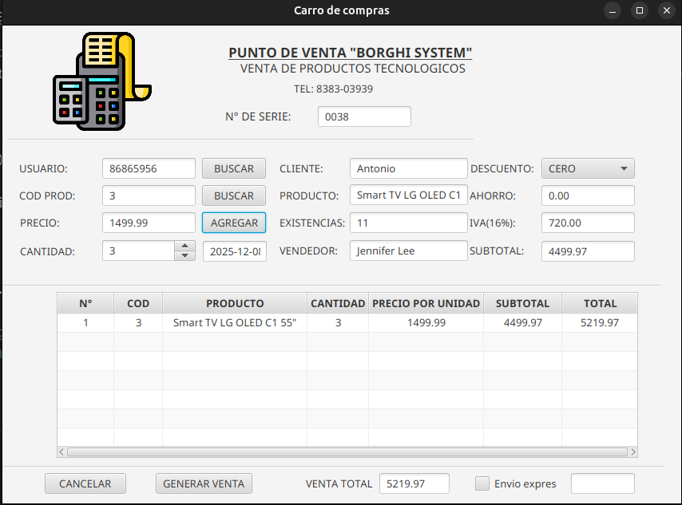
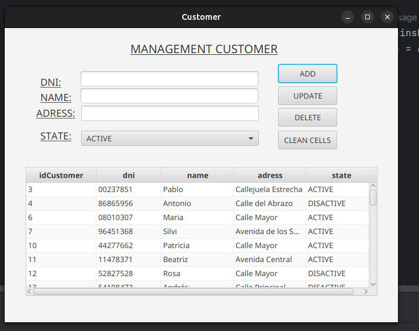
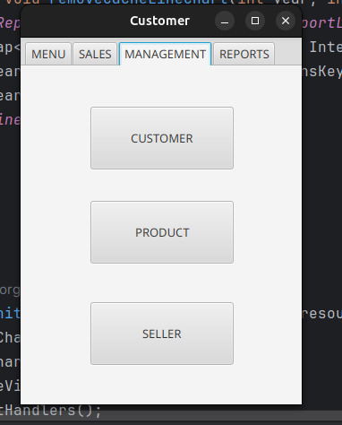

<h1 align="center" id="title">Proyecto FINAL Sistema de ventas en Java FX</h1>
<h5 align="center"> Programación orientada a objetos </h5>
<h6 align="center"> Equipo 12 FMAT Universidad Autonoma De Yucatán </h6>
<h1></h1>

[](https://opensource.org/licenses/MIT)

<p align="center">
  
</p>

#
# Índice
<!-- TOC -->
* [📑 Descripción del Proyecto](#-descripción-del-proyecto)
* [📗 Diagrama UML](#-diagrama-uml)
* [🧷 Manejo de Errores](#-manejo-de-errores)
    * [Error 1](#error-1)
    * [Error 2](#error-2)
    * [Error 3](#error-3)
* [💡 Propuesta de Mejoras](#-propuesta-de-mejoras)
    * [Mejora 1](#error-1)
    * [Mejora 2](#mejora-2)
    * [Mejora 3](#mejora-3)
    * [Mejora 4](#mejora-4)
* [💡 Mejoras Implementadas](#-mejoras-implementadas)
    * [Implementación 1](#implementación-1)
    * [Implementación 2 2](#implementación-2)
* [📽️ Video Presentación](#-video-presentación)
#  
<!-- TOC -->
## [+] Descripción del Proyecto
Matricula: 24216391
Nombre: Oscar de la Rosa Garcia
Usuario de git: Lightz18
Yo me encargue de la traduccion de la interfaz visible para los usuarios y ajuste los elemntos de estas para mayor organizacion y resultara mas comodo de emplear para el usuario. Ademas agregue un fondo y detalles a la interfaz de inicio para que fuera mas amigable. Corregi el bug del cambio de comas por puntos y repare el boton de AYUDA y le cree una interfaz con su controlador. Propuse las mejoras de stockMinimo y la de Envio, e implemente la de Envio donde cree 4 clases donde 3 de estas pertenecian a un package envio y la otra si se encontraba en model y tambien corregi errores detectados en esta mas adelante. Participe en la elaboracion del video donde se muestra la funcionalidad del sistema<br>
Usuario de git: ErickVega57
Yo me encargue de la implementación del monto de descuento del subtotal y del iva dentro del programa, además de principalmente corregir errores y tambien de implentar alguinas funciones para hacer mas legible y estructurado el código, ademas tambien de agregar todos esos cambios hacia la interfaz grafica para hacerlo totalmente fiuncional, también manjee un fork del repositorio y de gestionar pull request entre mi compañero y yo<br>


## [+] Diagrama UML

Use a digital tool (like Lucidchart, Draw.io, or any UML software) to create a UML diagram that represents these entities.
Ensure that the diagram is clear and accurately reflects the structure of the code.
Important: Add the UML diagram to the README file in the repository.


## [+] Manejo de Errores

### *Error 1:* 
El primer error identificado en el proyecto es que al cerrar una ventana para regresar a la amterior ,al abrir la nueva ventana, el título de esta no cambiaba y se mantenia con la anterior.<br>

<p align="center">
  
</p>
<p align="center">
  
</p>

**Motivo del problema**<br><br>
El problema identificado que causaba el error es que al cerrar una ventana e ir a la anterior en la función <code>configureStageCloseEvent()</code> se pasaba como parametro el titulo del stage actual, es decir, al cerrar una ventana se mantenia con el titulo de la ventana anterior.
```java
  private void configureStageCloseEvent(Stage stage, String fxmlFileName, String title) {
        if (!fxmlFileName.equals(MAIN_VIEW_FXML)) {
            stage.setOnCloseRequest(e -> {
                openNewStage(getFxmlFather(fxmlFileName),title); //titulo actual
            });
        }
    }
```
**Solución**<br><br>
Para la solución del problema se creó un nuevo método en la clase <code>MenuController</code> llamado <code>getPreviousTitle()</code> para que antes de pasar como párametro el título del stage actual, mande el título del stage anterior a ese.
```java
 private String getPreviousTitle (String fxmlFileName){
        fxmlFileName = getFxmlFather(fxmlFileName);
        switch (fxmlFileName){
            case MANAGEMENT_VIEW_FXML:
                return "Menú principal";
            case PRODUCT_VIEW_FXML:
                return "Producto";
            case REPORT_VIEW_FXML:
                return "Generar reporte";
            case SALE_DETAIL_VIEW_FXML:
                return "Detalles de venta";
            case SELLER_VIEW_FXML:
                return "Menú de vendedor";
            case GENERATE_SALE_VIEW_FXML:
                return "Generar venta";
            case CUSTOMER_VIEW_FXML:
                return "Menú de cliente";
            case HELP_VIEW_FXML:
                return "Panel de Ayuda";
            default:
                return "Inicio de Sesión";
        }
    }
```
Así se obtiene el título de la ventana anterior y se corrige en la función <code>configureStageCloseEvent()</code> 
```java
 private void configureStageCloseEvent(Stage stage, String fxmlFileName) {
        if (!fxmlFileName.equals(MAIN_VIEW_FXML)) {
            stage.setOnCloseRequest(e -> {
                //obtener titulo de la ventana anterior
                String previousTitle = getPreviousTitle(fxmlFileName);
                openNewStage(getFxmlFather(fxmlFileName), previousTitle);
            });
        }
    }
```


### *Error 2:*
El segundo problema identificado dentro del programa es que al abrir alguna ventana encima de otra, es decir "emergentes", por ejemplo, los detalles de ventas, o cuando no existe algun producto y vendedor y lo deseas agregar se abren pero las dimenciones estan incorrectas siendo muy incomodas de manejar.<br><br>
**Motivo del problema**<br><br>
El motivo del problema es que el tamaño de las ventanas "emergentes" no estan bien configurados, ademas de que los titulos de las ventanas hay que ponerlos uno por uno.<br>
```java
   private void openCustomerManagementView() {
        FXMLLoader fxmlLoader = new FXMLLoader(MenuController.class.getResource(CUSTOMER_VIEW_FXML));

        try {
            scene = new Scene(fxmlLoader.load());
        } catch (IOException e) {
            throw new RuntimeException(e);
        }

        stage = new Stage();
        stage.setTitle("Manage Customer");
        stage.setScene(scene);
        stage.show();
    }
```
**Solución**<br><br>
Por lo que para la solución de esta problematica se decicidió aislar este tipo de ventanas ya que la clase <code>MenuController</code> como el nombre lo indica está mas enfocada al manejo de menus, que son como estas ventanas pero al cerrar no regresan a la anterior, aparte de ser no redimencionables.<br>
La Clase implementada fue <code>TabController</code> que aisla la lógica de estas ventanas por lo que con la función <code>openNewTab()</code> unicamente tienes que darle el nombre del archivo de la vista y la abre de manera correcta y segura, ademas al ser publica puedes abrir una ventana "emergente" cuando se requiera
<br>
```java
   public class TabController extends ViewFiles {

    //funcion para abrir un tab
    public static void openNewTab(String fxmlFileName){
        FXMLLoader fxmlLoaderSaleDetails = new FXMLLoader(MenuController.class.getResource(fxmlFileName));
        try {
            Scene scene = new Scene(fxmlLoaderSaleDetails.load());
            Stage stage = new Stage();
            String title = getTitle(fxmlFileName); //funcion de la clase que obtiene el titulo de la ventana
            stage.setTitle(title); 
            stage.setScene(scene);
            configureSize(fxmlFileName, stage); //funcion que configura el tamaño correcto para la ventana
            stage.setResizable(false);
            stage.show();
        } catch (IOException e) {
            throw new RuntimeException(e);
        }
    }
```
Ahora el título de la ventana obtiene el nombre correcto con el que se debería de mostrar.
### *Error 3:*
Probelama con la funcionalidad del boton AYUDA.<br><br>
**Motivo del problema**<br><br>
Al seleccionar el boton AYUDA el sistema se bloqueaba, no respondia y al cabo de un rato dejaba de funcionar.<br>
```java
public void help(ActionEvent actionEvent) {
        try {
            Desktop.getDesktop().browse(new URI("https://github.com/Borghii/Sales-System"));
        } catch (Exception e) {
            e.printStackTrace();
            setAlert(Alert.AlertType.ERROR,"The URL could not be opened. Check your internet connection.");
        }
```
**Solución**<br><br>
Se modifico la funcion del ManagementController.<br>
```java
public void help(ActionEvent actionEvent) {
        lastTab = tabPaneManage.getSelectionModel().getSelectedIndex();
        openNewStage(HELP_DETAIL_VIEW_FXML,"Ayuda");
```
Ademas se agrego una interfaz que muestra detalles del sistema.<br>
```java
<?xml version="1.0" encoding="UTF-8"?>

<?import javafx.scene.control.*?>
<?import javafx.scene.layout.*?>
<?import javafx.scene.text.Font?>

<AnchorPane xmlns="http://javafx.com/javafx"
            xmlns:fx="http://javafx.com/fxml"
            fx:controller="org.borghisales.salessysten.controllers.HelpController"
            prefHeight="400.0" prefWidth="600.0">

    <!-- Título de la ventana -->
    <Label layoutX="150.0" layoutY="10.0" prefWidth="300.0" prefHeight="40.0"
           text="AYUDA" underline="true" alignment="CENTER">
        <font>
            <Font size="28.0"/>
        </font>
    </Label>

    <!-- Área de texto con instrucciones -->
    <TextArea fx:id="textAreaHelp" layoutX="50.0" layoutY="70.0" prefWidth="500.0" prefHeight="250.0"
              editable="false" wrapText="true">
        <text>
            Bienvenido al sistema Borghi Sales System.

            Aquí puedes:
            - Registrar ventas.
            - Gestionar clientes.
            - Agregar productos al carrito.
            - Seleccionar opciones de envío y calcular el total.

            Para más información sobre el sistema, puedes consultar el repositorio en GitHub.
        </text>
    </TextArea>

    <!-- Botón para cerrar la ventana -->
    <Button layoutX="250.0" layoutY="340.0" prefWidth="100.0" text="Cerrar" onAction="#closeWindow"/>

</AnchorPane>
```
Tambien se agrego un HelpController para el contenido de esta.<br>
```java
    public void initialize(URL url, ResourceBundle resourceBundle) {
        // Aquí se puede inicializar texto por defecto si se desea
        if (textAreaHelp != null && textAreaHelp.getText().isEmpty()) {
            textAreaHelp.setText(
                    "Bienvenido al sistema Borghi Sales System.\n\n" +
                            "- Registrar ventas.\n" +
                            "- Gestionar clientes.\n" +
                            "- Agregar productos al carrito.\n" +
                            "- Seleccionar opciones de envío y calcular el total.\n\n" +
                            "Para más información sobre el sistema, consulta el repositorio en GitHub."
            );
        }
    }
     @FXML
      private void closeWindow(ActionEvent event) {
          Stage stage = (Stage) ((javafx.scene.Node) event.getSource()).getScene().getWindow();
          stage.close();
      }
```


## [+] Propuesta de Mejoras
### *Mejora 1:* <br><br>
La primera propuesta de mejora consiste en implementar el cálculo del IVA en cada venta, de modo que el sistema ya no solo muestre el total “en bruto”, sino que desglosa el **subtotal sin impuestos**, el **monto de IVA** aplicado y el **total a pagar**. Para lograrlo, se definió una tasa de IVA fija (`IVA_RATE = 0.16`) y se integró en el flujo de cálculo de la venta y del carrito de compras.
### *Relacion con la POO:* <br><br>
Esta mejora se relaciona directamente con la Programación Orientada a Objetos porque:
- **Encapsulación:** La lógica del IVA se maneja a través de atributos y métodos específicos (por ejemplo, el uso de `IVA_RATE` como constante en el controlador y/o el modelo), evitando tener “números mágicos” dispersos por el código.
- **Responsabilidad única:** Cada clase mantiene una responsabilidad clara. El `ShoppingCart` se encarga de representar una línea de venta (producto, cantidad, precio, totales), mientras que el controlador (`GenerateSaleController`) coordina el cálculo global de subtotal, IVA y total de la venta.
- **Facilidad de mantenimiento y extensibilidad:** Al tener centralizada la tasa de IVA, si en el futuro cambia el porcentaje o se requiere manejar varias tasas, basta con modificar esa parte del modelo o agregar nueva lógica, sin reescribir todo el código de cálculo.


### *Mejora 2:* <br><br>
La segunda propuesta de mejora consiste en implementar una selección de descuentos directamente en la interfaz de usuario al momento de realizar una venta, permitiendo elegir entre distintos porcentajes de descuento según el vendedor. Además, el sistema mostrará de forma explícita el monto ahorrado gracias al descuento aplicado, lo que hace el cálculo más transparente tanto para el usuario del sistema como para el cliente. Con esta mejora, el sistema de ventas se vuelve más claro para el cliente y para el vendedor.
### *Relacion con la POO:* <br><br>
Esta mejora también se apoya fuertemente en conceptos de POO:

- **Abstracción mediante tipos propios:** Se utiliza un tipo enumerado (`enum DiscountRate`) para representar las diferentes tasas de descuento (CERO, DIEZ, QUINCE, VEINTE, CINCUENTA). Esto abstrae el manejo de los porcentajes y evita trabajar directamente con valores “duros” en el código.
- **Encapsulación del comportamiento:** La lógica para obtener la tasa de descuento seleccionada se concentra en métodos como `getDiscountRate()`, y el cálculo de subtotales, totales y ahorro se realiza en métodos específicos (`CalcSubtotal`, `CalcTotal`, `CalcSaving`), manteniendo el código organizado y fácil de entender.
- **Reutilización de código:** Al centralizar el cálculo en métodos reutilizables, la misma lógica puede emplearse al actualizar la tabla del carrito, los campos de resumen (subtotal, IVA, total, ahorro) y el objeto `Sales` que se persiste en la base de datos.
- **Mantenibilidad:** Si en el futuro se desean agregar nuevos tipos de descuento o cambiar las reglas de negocio (por ejemplo, descuentos especiales por tipo de cliente o por volumen), basta con ampliar el `enum` o la lógica de cálculo, respetando la estructura existente sin romper el resto del sistema.


### *Mejora 3:* <br><br>
La tercera propuesta consiste en implementar la funcionalidad de envío de productos en cada venta, y cálculo total de la venta con envio , permitiendo que el sistema distinga entre envío estándar y envío exprés, mostrando el costo correspondiente y sumándolo automáticamente al total de la venta. Esto permitirá reflejar de manera más realista los montos finales y ofrecer al cliente opciones de envío según sus necesidades.<br>
### *Relacion con la POO:* <br><br>
La implementación del módulo de envío en el sistema aplica directamente los principios de la Programación Orientada a Objetos, ya que se crea una clase abstracta como base para los tipos de envio que definira el comportamiento general de el resto, y a partir de esta se crean clase concretas como extends, y aqui vemos el principio de herencia para extender un comportamiento en comun y polimorfismo cuando usas un metodo para calcular el envio segun el tipo de envio seleccionado                                      
### *Mejora 4:* <br><br>
La cuarta propuesta consite en implementar una funcionalidad que detecte cuando el inventario de un producto esté por debajo de un umbral mínimo y notifique al usuario antes de completar la venta. Esto permite prevenir la venta de productos agotados o con stock insuficiente, asegurando una gestión más eficiente del inventario y mejorando la experiencia del cliente.<br>
### *Relacion con la POO:* <br><br>
Vemos reflejada la herencia ya que existe una clase general como es product que contiene atributos que todos los productos comparte como seria el stockminimo y el stockactual, donde las clases mas especificas lo herendan. El polimorfismo lo vemos cuando hay una sola funcion que revisa si el stock llego al minimo para cada tipo de producto

## [+] Mejoras Implementadas

### *Implementación 1:* <br><br>
Para integrar ambas mejoras en el proceso de venta *el cálculo del IVA* y *la aplicación de descuentos* se realizaron modificaciones en el mismo apartado del sistema encargado de gestionar los totales de cada compra. La implementación comenzó incorporando nuevos atribustos al objeto sales, ya que aqui se guardan los atributos de cada venta. <br>
Los atributos a agregar son:
  + Discount
  + Iva
  + Subtotal
Para poder saber cuanto fue el impuesto, el descuento, y el subtotal (total sin iva ni descuento)<br>
Como queremos que los datos sean persistentes, primero agregamos las nuevas tablas a la base de datos.
```sql
ALTER TABLE sales
    ADD COLUMN subtotal DOUBLE NOT NULL DEFAULT 0,
    ADD COLUMN iva DOUBLE NOT NULL DEFAULT 0,
    ADD COLUMN discount DOUBLE NOT NULL DEFAULT 0;
```
Una vez añadidos los atributos a la base de datos los agregamos al constructor de sales.

```java
public record Sales(int idSales, int idCustomer, int idSeller, String numberSales, LocalDate saleDate, Double subtotal,
                    State state, double total, double iva, double discount) {
    public enum State{ACTIVE,DISACTIVE};

    public Sales(int idCustomer, int idSeller, String numberSales, LocalDate saleDate, Double subtotal, State state,
                 double total, double iva, double discount) {
        this(0, idCustomer, idSeller, numberSales, saleDate, subtotal, state, total, iva, discount);
    }

    public static Sales fromResultSet(ResultSet rs) throws SQLException {
        int idSales = rs.getInt("idSales");
        int idCustomer = rs.getInt("idCustomer");
        int idSeller = rs.getInt("idSeller");
        String numberSales = rs.getString("numberSales");
        LocalDate saleDate = rs.getDate("saleDate").toLocalDate();
        Double subtotal = rs.getDouble("subtotal");
        State state = State.valueOf(rs.getString("state"));
        //nuevos atributos
        double total = rs.getDouble("amount");
        double iva = rs.getDouble("iva");
        double discount = rs.getDouble("discount");
        //
        return new Sales(idSales, idCustomer, idSeller, numberSales, saleDate, subtotal, state, total, iva, discount);
    }
}
```
Una vez añadido los atributos al objeto sales actualizamos la funcion de la clase <code>SalesDAO</code> llamada <code>SaveSale()</code> para guardar los nuevos atributos al generar una venta.
```java
 public boolean SaveSale(Sales sale){
        String sql = "INSERT INTO sales (idCustomer,idSeller,numberSales,saleDate,amount,state, subtotal, iva, discount) " +
                "values(?,?,?,?,?,?,?,?,?)";

        try (Connection conn = DBConnection.connection();
             PreparedStatement pstmt = conn.prepareStatement(sql)){

            pstmt.setInt(1,sale.idCustomer());
            pstmt.setInt(2,sale.idSeller());
            pstmt.setString(3,sale.numberSales());
            pstmt.setDate(4, Date.valueOf(sale.saleDate()));
            pstmt.setDouble(5,sale.subtotal()); //total con IVA y descuento
            pstmt.setString(6,sale.state().name());
            //nuevos atributos
            pstmt.setDouble(7,sale.total());
            pstmt.setDouble(8,sale.iva());
            pstmt.setDouble(9,sale.discount());

            int rows_affected = pstmt.executeUpdate();

            if (rows_affected>0){
                MenuController.setAlert(Alert.AlertType.CONFIRMATION, "Sale saved correctly");
                return true;
            }else{
                MenuController.setAlert(Alert.AlertType.ERROR, "Error saving sale: ");
                return false;
            }

        }catch (SQLException e){
            MenuController.setAlert(Alert.AlertType.ERROR, "Error saving sale: " + e.getMessage());
            return false;
        }

    }
```
Ya que tenemos los atributos definidos en el constructor y listos para que se puedadn guardar en la base de datos, pasamos a la parte de generar una venta con estos nuevos atributos. <br>
Esta lógica para controlar el Iva y el descuento y el calculo del subtotal lo hacemos desde el <code>GenerateSalesController</code> ya que aqui se lleva a cabo toda la lógica de la interfaz e interna de lo que debe de hacer sales.<br>

primero definimos una variable constante para el iva.
```java
 private static final double IVA_RATE = 0.16;
```
y para el descuento, creamos un enum para seleccionar que descuento queremos.
el enum creado se crea en el paquete <code>org.borghisales.salesysten.util</code>
```java
public enum DiscountRate {
    CERO (1.00),
    DIEZ (0.90),
    QUINCE (0.85),
    VEINTE (0.80),
    CINCUENTA (0.50);

    private final double rate;

    DiscountRate(double rate){this.rate = rate;}
    public double getRate(){return rate;}
}
```
ahora ya tenemos una manera de asignar el descuento y de usar el iva para calcular los montos que necesitamos


Una vez calculado el subtotal con descuento, se añadió el procesamiento del IVA utilizando una tasa fija establecida en el sistema. El impuesto se calcula automáticamente sobre el subtotal resultante y se muestra desglosado en la interfaz, junto con el total final que el cliente debe pagar.
Para que se muestre desglosado en la interfaz, se utiliza el objeto ShoppingCart que es principalmente un objeto para la interfaz gráfica, las tablas que salen en el programa y le agregamos los calculos en el construtor


En la interfaz de usuario también se realizaron ajustes: se agregó un componente de selección de descuento (ComboBox) para permitir elegir entre diferentes porcentajes, y se añadieron campos informativos que muestran dinámicamente el subtotal, el descuento aplicado, el monto ahorrado, el IVA y el total a pagar. Estos elementos se actualizan en tiempo real conforme el usuario modifica la cantidad de productos o selecciona un porcentaje de descuento.

Con esta implementación conjunta, el sistema ahora ofrece un cálculo más completo, transparente y funcional, integrando tanto la gestión de impuestos como la flexibilidad de aplicar descuentos dentro de un mismo flujo de trabajo, mejorando la precisión y usabilidad del módulo de ventas.


### *Implemenrtación 2:* <br><br>
Se agrego un precio de envio visible para el usuario. Para esto se creo un package "envio" con 3 clases dentro de model:
-Envio:
```java
package org.borghisales.salessysten.model.envio;

public abstract class Envio {
    protected double costoBase;

    public Envio(double costoBase) {
        this.costoBase = costoBase;
    }

    public abstract double calcularCosto();
}
```
-EnvioEconomico:
```java
package org.borghisales.salessysten.model.envio;

public class EnvioEconomico extends Envio {

    public EnvioEconomico() {
        super(80);
    }

    @Override
    public double calcularCosto() {
        return costoBase;
    }
}
```
-EnvioExpres:
```java
package org.borghisales.salessysten.model.envio;

public class EnvioExpres extends Envio {

    public EnvioExpres() {
        super(150);
    }

    @Override
    public double calcularCosto() {
        return costoBase;
    }
}
```
Estas sirvieron como una clase Envio abstracta general de la que heredan la otras 2 y calcula el total de la venta con envio.<br>


Tambien se creo una clase que calcula la venta con el envio para ver el costo final.
```java
package org.borghisales.salessysten.model;

import org.borghisales.salessysten.model.envio.Envio;

public class VentaConEnvio {
    private final Sales venta;
    private final Envio envio;

    public VentaConEnvio(Sales venta, Envio envio) {
        this.venta = venta;
        this.envio = envio;
    }

    public double calcularTotal() {
        return venta.amount() + envio.calcularCosto();
    }
}
```
Ademas dentro de la clase GenerateSaleController se implementaron funcionalidades para que sea visible el cambio en la interfaz de generar ventas y se agrego un checkbox y un textfield al GenerateSaleVeiw para que se refleje claramente en la interfaz el precio segun se seleccione o no el envio expres


## [+] Video Presentación
.

<a href="https://youtu.be/27jQScHEgNs">
  
</a>


💻🎯🔒📗📚📈🧷☢️


# Reports

