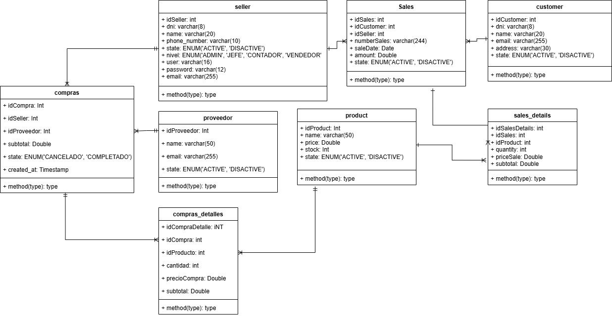
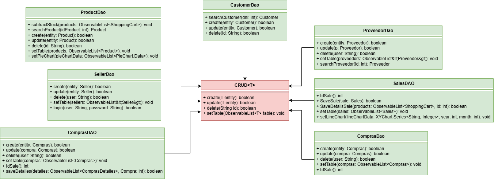
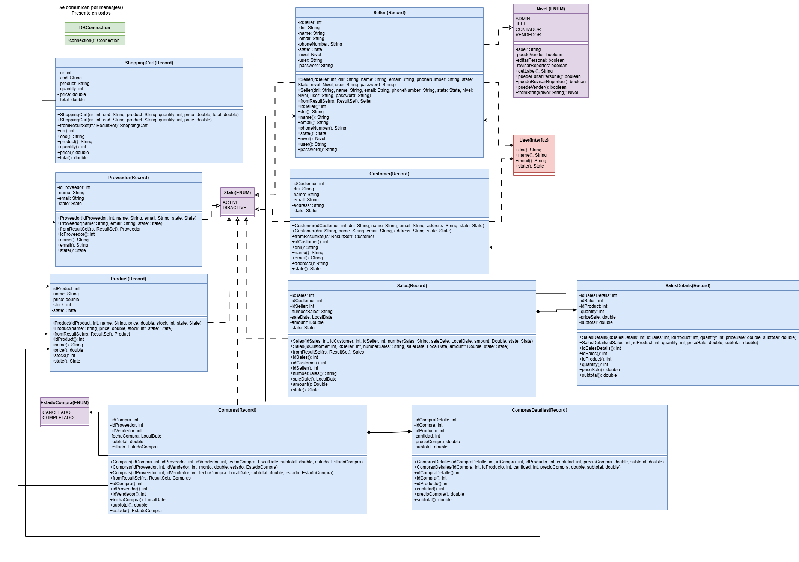

<h1 align="center" id="title"> Sistema de ventas en Java FX</h1>
<h6 align="center"> Aplicación de Gestión de Ventas con Java 17, JavaFX, MySQL y Patrones de Diseño MVC y DAO </h6>
<h1></h1>

  

<!-- TOC -->
* [📑 Descripcion](#-descripcion)
* [💻 Entorno](#-entorno)
* [🚀 Instalacion](#-instalacion)
    * [Instalacion del JDK 17](#instalación-del-jdk-17)
    * [Configuracion de la Base de Datos](#configuración-de-la-base-de-datos)
    * [Ejecucion del Proyecto](#ejecución-del-proyecto)
    * [Modificacion de las Vistas con Scene Builder](#modificación-de-las-vistas-con-scene-builder)
* [🧬 Estructura Basica](#-estructura-basica)
* [🗄️ Diagrama de Base de Datos](#-diagrama-de-base-de-datos)
* [💡 Fucionalidades](#-fucionalidades)
    * [Inicio de Sesion](#inicio-de-sesión)
    * [Pantalla Principal](#pantalla-principal)
        * [Sales](#sales)
        * [Management](#management)
        * [Reports](#reports)
* [📧 Contacto](#-contacto)
* [📝 Licencia](#-licencia)
<!-- TOC -->

# 📑 Descripcion
Este proyecto es una herramienta que diseñé para mejorar mis habilidades con el lenguaje Java, centrándome en la gestión de ventas para vendedores. Utiliza los patrones de diseño MVC (Modelo-Vista-Controlador) y DAO (Data Access Object) para una arquitectura robusta y modular.

Con esta aplicación, puedes iniciar sesión como vendedor, administrar tus productos y clientes, así como realizar ventas de manera sencilla. Además, cuenta con una sección de reportes donde puedes ver detalles de tus ventas, filtrarlas y generar informes personalizados.

Todos los datos se almacenan de forma segura en una base de datos MySQL, utilizando el patrón DAO para separar la lógica de acceso a datos de la lógica de negocio. Esto garantiza un código más limpio, mantenible y escalable.

Además, hay una sección de estadísticas que te muestra cuántas ventas has realizado de cada producto y cómo han variado a lo largo del tiempo, utilizando el patrón MVC para separar la lógica de presentación de la lógica de negocio y la manipulación de datos.

# 💻 Entorno

Este proyecto requiere las siguientes herramientas y versiones:

* SO: Windows  
* Java: 17 
* Maven: 3.8.5 
* MySQL: 8.0.33 
* JavaFX: 21

# 🚀 Instalacion
Para utilizar este proyecto, simplemente clona el repositorio en tu máquina local y sigue estos pasos:

## Instalación del JDK 17
Para ejecutar este proyecto, necesitarás tener instalado el JDK 17. Sigue estos pasos para instalarlo:

1. Descarga del JDK 17: Visita la página de descargas de Oracle JDK en https://www.oracle.com/java/technologies/javase-jdk17-downloads.html.
2. Selecciona tu sistema operativo: Descarga la versión adecuada del JDK 17 para tu sistema operativo. Asegúrate de seleccionar la versión correcta para Windows.
3. Instalación: Una vez descargado el archivo de instalación, sigue las instrucciones proporcionadas por Oracle para instalar el JDK 17 en tu sistema.
4. Configuración de las Variables de Entorno (Opcional): Después de instalar el JDK 17, puedes configurar las variables de entorno JAVA_HOME y PATH en tu sistema para que apunten al directorio de instalación del JDK. Esto facilitará el uso del JDK desde la línea de comandos.

## Configuración de la Base de Datos
Antes de ejecutar el proyecto, asegúrate de configurar la base de datos:

1. Instala MySQL: Si aún no tienes MySQL instalado, descárgalo e instálalo desde https://dev.mysql.com/downloads/mysql/.
2. Crea la Base de Datos: Utiliza el script proporcionado llamado salesystem.sql para importar la base de datos y las tablas necesarias.
3. Configura la Conexión: Para configurar la conexión a la base de datos, sigue estos pasos:
   * Crea un archivo llamado config.properties en la ruta src/main/java/org/borghisales/salessystem/model/.
   * Define las propiedades de configuración para la conexión a la base de datos en el archivo config.properties. 
   * Las propiedades necesarias son db.url, db.user y db.password. Por ejemplo:
   <pre>
   db.url=jdbc:mysql://localhost:3306/salesystem
   db.user=usuario
   db.password=contraseña
   </pre>
   
   Asegúrate de reemplazar nombre_basedatos, usuario y contraseña con los valores correspondientes de tu entorno de desarrollo.
## Ejecución del Proyecto
Una vez que hayas configurado la base de datos, puedes ejecutar el proyecto siguiendo estos pasos:

1. Clona el Proyecto: Clona este repositorio en tu máquina local utilizando Git o descargando el archivo ZIP.
2. Importa el Proyecto: Importa el proyecto en tu IDE preferido (como IntelliJ, Eclipse, etc.) como un proyecto Maven existente.
3. Verifica las Dependencias: Antes de compilar y ejecutar el proyecto, asegúrate de que todas las dependencias estén resueltas correctamente. Esto se puede hacer actualizando Maven o ejecutando el comando mvn clean install desde la línea de comandos en el directorio del proyecto. Esto garantizará que todas las dependencias se descarguen y configuren correctamente.
4. Compila y Ejecuta: Compila y ejecuta el proyecto desde tu IDE. Asegúrate de ejecutar la clase principal adecuada (si es necesario) para iniciar la aplicación.

## Modificación de las Vistas con Scene Builder
Si deseas modificar las vistas de la aplicación, puedes utilizar Scene Builder, una herramienta gráfica para diseñar interfaces de usuario JavaFX. Para instalar Scene Builder, sigue estos pasos:

1. Descarga Scene Builder: Puedes descargar Scene Builder desde el sitio web oficial de Gluon https://gluonhq.com/products/scene-builder/.
2. Instalación: Una vez descargado, sigue las instrucciones de instalación para tu sistema operativo.

# 🧬 Estructura Basica
<pre>
+ java
  |-- controllers // controladores de la aplicacion
  |-- model	// modelos de datos de la aplicación
  --Main.java // donde se inicia la ejecución del programa      
+ Resources
  |-- images // imágenes utilizadas en la aplicación
  |-- views // vistas de la aplicación fxml
  |-- reports // informes generados por la aplicación
</pre>

# 🗄️ Diagrama de Base de Datos

  

# 💡 Fucionalidades

## Inicio de sesión
Para iniciar sesión, se requiere el DNI y la contraseña del vendedor. En la base de datos, estos corresponden a los atributos del vendedor(seller), donde el DNI se asocia con 'dni' y la contraseña con 'user'.

  

## Pantalla principal
La pantalla principal muestra las siguientes ventanas
* Menu: incluyen la posibilidad de salir o visitar la documentación

  

* Sales: Permite generar nuevas ventas.

  

* Management: Ofrece operaciones CRUD (Crear, Leer, Actualizar, Eliminar) para clientes, productos y vendedores.

  

* Reports: Aquí se encuentran las operaciones de reportes y estadísticas relacionadas.

  

## Sales
https://github.com/Borghii/Sales-System/assets/137845283/60872beb-31af-47b0-b84d-83f9b4807ac5
## Management
https://github.com/Borghii/Sales-System/assets/137845283/4f85ec7c-f2de-44ae-815b-218c9ca25b10
## Reports
https://github.com/Borghii/Sales-System/assets/137845283/f85f1026-6693-4152-a793-6bfe02a8869f

# 📧 Contacto
Si tienes alguna pregunta, sugerencia o crítica sobre el proyecto, no dudes en contactarme por correo electrónico a [tomasborghi13@gmail.com](mailto:tomasborghi13@gmail.com).

# Errores encontrados

## Falta de validaciones

### Validacion de conexion

En caso que no se pueda conectar con la base de datos y/o que no se pueda encontrar el archivo de configuraciones, no muestra esta falla hasta que se intenta iniciar sesi�n o bien ni ello

### Validacion en tipo de dato

Varios campos de los formularios permiten varios tipos de datos, pese a que el objeto o entidad a la que se hace referencia tiene otro tipo de dato, esto provoca que el programa colapse al no poder procesar estos datos y no haber un control de exepciones

### Validacion de seguridad

Esto aplica unicamente para los vendedores, esto es una falta de logica en practicas, pues la vista actual muestra control absoluto de productos, clientes e incluso otros vendedores para cualqueira que sea el vendedor que inicio sesion.
Esto es un grave error, pues en lo practico, si un vendedor nuevo tiene tal acceso, podria incluso eliminar al vendedor con mayor experiencia o eliminar productos/clientes sin raz�n.

## Botones problematicos

### Boton cancelar 

En la pestaña de generar ventas, este boton no tenia funcionalidad original, suponiendo debiera cancelar el proceso de generar la venta, deberia limpiar las celdas

### Boton help

Este boton originalmente buscaba abrir directamente el repositorio del proyecto para buscar detalles de este en el propio github.
Sin embargo, no habria el enlace y en su lugar provocaba una falla en el programa que lo congelaba

# Nueva base de datos

  

# Propuestas implementadas

## Sistema de Autenticación y Unicidad de Datos
**Base de datos:** Se agregó el atributo password en la tabla seller para implementar un sistema de autenticación robusto. Adicionalmente, se establecieron restricciones de unicidad tanto para el campo usuario como para el DNI, garantizando que no existan registros duplicados. Se realizaron ajustes en diversas funciones del sistema para mantener la integridad de estos nuevos requisitos.

**Implementación:** La función de login fue modificada para operar con usuario y contraseña como credenciales de acceso. Por practicidad y para facilitar las pruebas iniciales del sistema, se estableció que cada DNI funcione como contraseña predeterminada, simplificando el proceso de configuración inicial. Las funciones del CRUD, incluyendo addSeller y sus equivalentes, fueron actualizadas para incorporar el nuevo campo de contraseña. Se implementó además un sistema de validación que verifica que ningún parámetro quede en blanco antes de realizar operaciones en la base de datos, previniendo así la inserción de datos incompletos.

**Justificación:** La prevención de duplicaciones en el DNI y el usuario es fundamental para mantener la integridad del sistema de identificación de vendedores. Permitir duplicados generaría serios problemas al momento de identificar y autenticar a los usuarios, potencialmente comprometiendo la seguridad y funcionalidad del sistema. Este cambio también establece congruencia con el sistema de login principal, ya que anteriormente existía una inconsistencia donde no se utilizaba la combinación de usuario y contraseña para el acceso. Con esta implementación, se logra un sistema de autenticación coherente y alineado con las mejores prácticas de seguridad.

## Reparación y Mejora del Botón de Ayuda

**Interfaz:** Durante las pruebas iniciales se detectó que el botón de ayuda presentaba fallos en su funcionamiento. Como solución temporal y como un elemento de alivio cómico para el usuario, se implementó una vista alternativa que permitía cerrar el programa de forma rápida y amigable. Posteriormente, se restauró la funcionalidad original del botón, que consiste en dirigir al usuario hacia la documentación del sistema. Esta funcionalidad dual ahora permite tanto acceder a la documentación como al repositorio del proyecto, brindando mayor utilidad al botón.

**Implementación:** Se desarrolló una nueva vista junto con su controlador correspondiente para manejar las interacciones del botón de ayuda. Dado que esta funcionalidad no requiere persistencia de datos ni interacción directa con la base de datos, no fue necesario crear un modelo asociado. La implementación se mantuvo simple y enfocada en la presentación y control de la interfaz.

**Justificación:** Era imperativo darle funcionalidad real al botón help, que originalmente no cumplía con su propósito. Los usuarios necesitan acceso fácil y rápido a la documentación y recursos de ayuda, especialmente cuando enfrentan dudas sobre el uso del sistema. Esta reparación mejora significativamente la experiencia del usuario y la usabilidad general de la aplicación.

## Encapsulación y Refactorización del Código

**POO:** Se identificaron múltiples atributos compartidos entre las entidades de vendedores y clientes, lo que representaba una oportunidad clara de aplicar principios de encapsulación. Se creó una interfaz común que agrupa estos atributos compartidos, eliminando la duplicación de código. Además, se detectó que varias entidades utilizaban un atributo ENUM con propiedades idénticas para representar estados. En lugar de mantener múltiples definiciones del mismo ENUM, se centralizó en una única definición común accesible para todas las entidades que lo requieran.

**Patrones:** Como parte de una mejor organización del código y siguiendo patrones de diseño establecidos, se reorganizó la estructura del proyecto separando todas las entidadesDAO en su propia carpeta dedicada dentro del directorio models. Esta separación mejora la legibilidad del código y facilita su mantenimiento futuro.

**Implementación:** Se creó una interfaz compartida capaz de encapsular los atributos comunes entre vendedores y clientes. La decisión de utilizar una interfaz en lugar de una superclase abstracta se basó en que las entidades están implementadas como records en Java, lo cual limita las opciones de herencia tradicional. Para el ENUM de estado, se creó una definición única centralizada que reemplazó todas las definiciones individuales que existían previamente en las diferentes entidades. Esto requirió actualizaciones en múltiples controladores y clases derivadas que hacían referencia a los ENUMs específicos de cada entidad, migrándolos todos al ENUM común.

**Justificación:** La existencia de un ENUM idéntico replicado en múltiples entidades constituía una violación del principio DRY (Don't Repeat Yourself) y generaba riesgo de inconsistencias futuras. Al centralizar esta definición, cualquier modificación o extensión del ENUM se propaga automáticamente a todas las entidades que lo utilizan. La misma lógica aplica para los atributos compartidos entre cliente y vendedor: ambas entidades representan tipos de usuarios con características muy similares, diferenciándose principalmente en su rol dentro del sistema. La encapsulación de estos atributos comunes no solo reduce la duplicación de código sino que también facilita futuras extensiones del sistema y mejora su mantenibilidad.

### Diagrama Dao

  

### Diagrama controller

  

## Sistema de Roles y Control de Acceso

**Base de datos:** Se incorporó un nuevo atributo de tipo ENUM en la tabla de vendedores que permite distinguir entre diferentes tipos o categorías de trabajadores. Este atributo establece una jerarquía organizacional dentro del sistema y determina los privilegios de acceso de cada usuario.

**Implementación:** Se diseñó e implementó un ENUM representativo que define claramente los diferentes niveles o roles de trabajadores. Cada valor del ENUM está asociado con niveles de acceso específicos que determinan qué vistas, funcionalidades y secciones del sistema puede acceder cada tipo de trabajador. Esta implementación permite un control granular sobre los permisos y capacidades de cada usuario según su rol organizacional.

**Justificación:** La implementación de un sistema de roles es fundamental para establecer un nivel de seguridad apropiado entre diferentes tipos de trabajadores. No todos los empleados deben tener acceso a todas las funcionalidades del sistema; por ejemplo, un vendedor regular no debería poder acceder a funciones administrativas o de gestión de personal. Este sistema de roles da sentido práctico al sistema de login, transformándolo de un simple mecanismo de identificación a un verdadero sistema de control de acceso basado en privilegios. Además, prepara el sistema para futuras expansiones donde puedan agregarse más roles con diferentes combinaciones de permisos.

## Sistema de Gestión de Compras e Inventario.

**Base de datos:** Se diseñó e implementó un subsistema completo para la gestión de compras, que funciona como el complemento lógico al sistema de ventas existente. Se crearon tres nuevas tablas interrelacionadas: una tabla principal de compras, una tabla de productos comprados que detalla los ítems específicos de cada compra, y una tabla de proveedores que registra la información de los suministradores. Estas tablas establecen una relación estructurada que permite rastrear el origen de cada producto en el inventario, vinculando las compras con los productos específicos adquiridos y los proveedores que los suministran.

**Implementación:** Se desarrolló un conjunto completo de componentes para soportar este nuevo subsistema. Esto incluyó la creación de las entidades correspondientes para cada tabla, sus respectivas clases DAO (Data Access Objects) para manejar las operaciones de base de datos, y los controladores necesarios para orquestar la lógica de negocio. Se implementó la lógica completa para agregar productos al inventario a través del proceso de compra, incluyendo validaciones, cálculos de costos, y actualización automática de existencias. El sistema permite registrar cada compra con su fecha, proveedor, productos incluidos, cantidades y precios, manteniendo un historial completo de las transacciones de aprovisionamiento.

**Justificación:** Este cambio proporciona al contador y a los administradores una forma estructurada y profesional de gestionar el inventario desde una perspectiva logística real. En lugar de simplemente agregar productos al sistema de forma arbitraria cuando el stock se agota, ahora existe un proceso formal que documenta cómo y de dónde provienen los productos. Esto es crucial para múltiples aspectos del negocio: permite un mejor control de costos al rastrear los precios de compra, facilita la contabilidad al mantener registros detallados de gastos, mejora las relaciones con proveedores al tener un historial de transacciones, y proporciona datos valiosos para análisis de rentabilidad al poder comparar precios de compra con precios de venta. Es una forma mucho más adecuada y profesional de manejar el ciclo completo del inventario, desde la adquisición hasta la venta.a.

## 📹 Video de Presentación

[Ver video de presentación del proyecto](https://youtube.com/tu-link-aqui)

### Contenido del video:
- Introducción del equipo
- Compilación y ejecución sin IDE
- Demostración de funcionalidades
- Explicación de mejoras implementadas
- Tour por las vistas

# 📝 Licencia

Este proyecto está bajo licencia. Ver el archivo [LICENSE](LICENSE) para más detalles.

[⬆ Volver al inicio](#title) 
