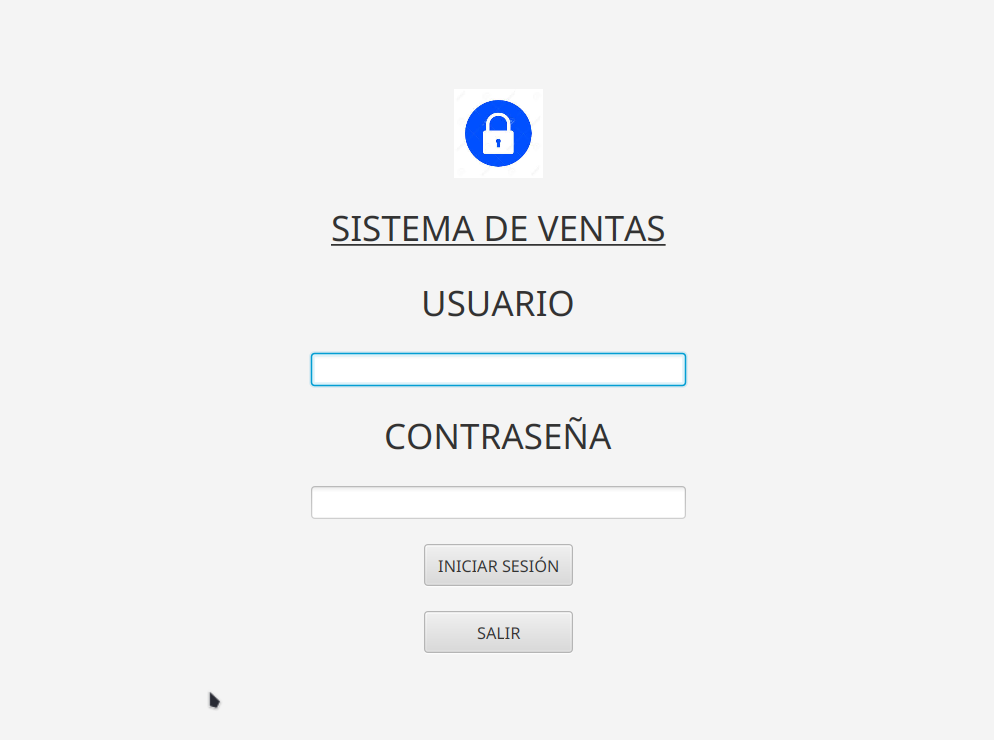
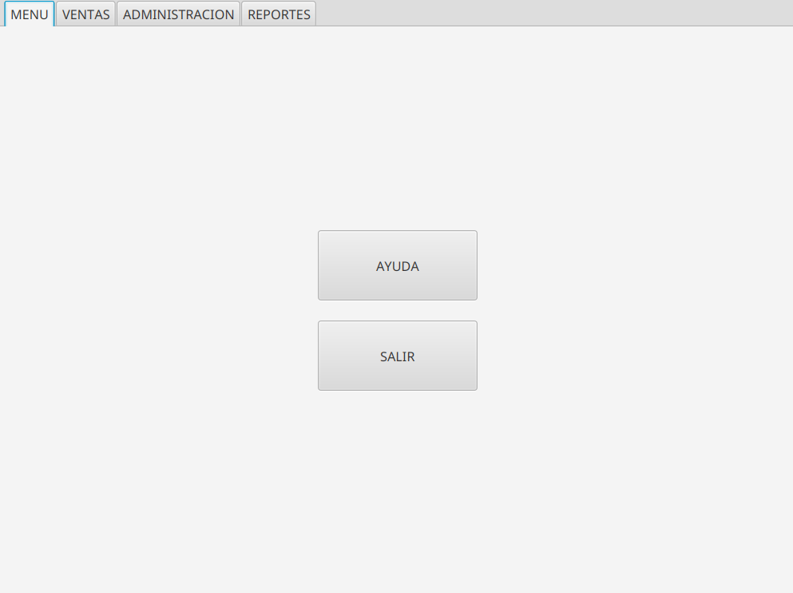
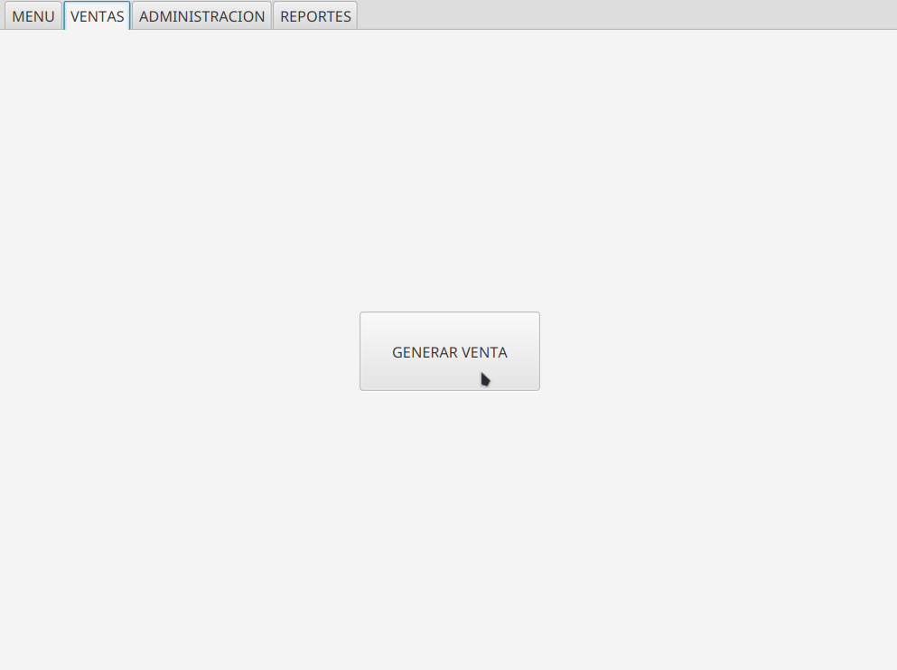
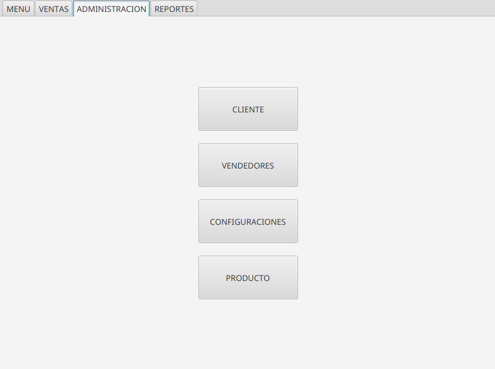
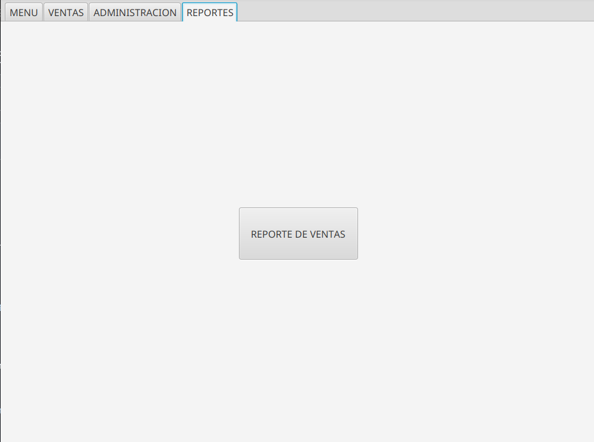

<h1 align="center" id="title"> Sistema de ventas en Java FX</h1>
<h6 align="center"> Aplicación de Gestión de Ventas con Java 17, JavaFX, MySQL y Patrones de Diseño MVC y DAO </h6>
<h1></h1>

[](https://opensource.org/licenses/MIT)

<p align="center">
  
</p>

<!-- TOC -->
* [📑 Descripcion](#-descripcion)
* [💻 Entorno](#-entorno)
* [🚀 Instalacion](#-instalacion)
    * [Instalacion del JDK 17](#instalación-del-jdk-17)
    * [Configuracion de la Base de Datos](#configuración-de-la-base-de-datos)
    * [Ejecucion del Proyecto](#ejecución-del-proyecto)
    * [Modificacion de las Vistas con Scene Builder](#modificación-de-las-vistas-con-scene-builder)
* [🧬 Estructura Basica](#-estructura-basica)
* [🗄️ Diagrama de Base de Datos](#-diagrama-de-base-de-datos)
* [💡 Fucionalidades](#-fucionalidades)
    * [Inicio de Sesion](#inicio-de-sesión)
    * [Pantalla Principal](#pantalla-principal)
        * [Sales](#sales)
        * [Management](#management)
        * [Reports](#reports)
* [📧 Contacto](#-contacto)
* [📝 Licencia](#-licencia)
<!-- TOC -->

# 📑 Descripcion
Este proyecto es una herramienta que diseñé para mejorar mis habilidades con el lenguaje Java, centrándome en la gestión de ventas para vendedores. Utiliza los patrones de diseño MVC (Modelo-Vista-Controlador) y DAO (Data Access Object) para una arquitectura robusta y modular.

Con esta aplicación, puedes iniciar sesión como vendedor, administrar tus productos y clientes, así como realizar ventas de manera sencilla. Además, cuenta con una sección de reportes donde puedes ver detalles de tus ventas, filtrarlas y generar informes personalizados.

Todos los datos se almacenan de forma segura en una base de datos MySQL, utilizando el patrón DAO para separar la lógica de acceso a datos de la lógica de negocio. Esto garantiza un código más limpio, mantenible y escalable.

Además, hay una sección de estadísticas que te muestra cuántas ventas has realizado de cada producto y cómo han variado a lo largo del tiempo, utilizando el patrón MVC para separar la lógica de presentación de la lógica de negocio y la manipulación de datos.

# 💻 Entorno

Este proyecto requiere las siguientes herramientas y versiones:

* SO: Windows <br>
* Java: 17<br>
* Maven: 3.8.5<br>
* MySQL: 8.0.33<br>
* JavaFX: 21


# 🚀 Instalacion
Para utilizar este proyecto, simplemente clona el repositorio en tu máquina local y sigue estos pasos:

## Instalación del JDK 17
Para ejecutar este proyecto, necesitarás tener instalado el JDK 17. Sigue estos pasos para instalarlo:

1. Descarga del JDK 17: Visita la página de descargas de Oracle JDK en https://www.oracle.com/java/technologies/javase-jdk17-downloads.html.
2. Selecciona tu sistema operativo: Descarga la versión adecuada del JDK 17 para tu sistema operativo. Asegúrate de seleccionar la versión correcta para Windows.
3. Instalación: Una vez descargado el archivo de instalación, sigue las instrucciones proporcionadas por Oracle para instalar el JDK 17 en tu sistema.
4. Configuración de las Variables de Entorno (Opcional): Después de instalar el JDK 17, puedes configurar las variables de entorno JAVA_HOME y PATH en tu sistema para que apunten al directorio de instalación del JDK. Esto facilitará el uso del JDK desde la línea de comandos.

## Configuración de la Base de Datos
Antes de ejecutar el proyecto, asegúrate de configurar la base de datos:

1. Instala MySQL: Si aún no tienes MySQL instalado, descárgalo e instálalo desde https://dev.mysql.com/downloads/mysql/.
2. Crea la Base de Datos: Utiliza el script proporcionado llamado salesystem.sql para importar la base de datos y las tablas necesarias.
3. Configura la Conexión: Para configurar la conexión a la base de datos, sigue estos pasos:
   * Crea un archivo llamado config.properties en la ruta src/main/java/org/borghisales/salessystem/model/.
   * Define las propiedades de configuración para la conexión a la base de datos en el archivo config.properties. 
   * Las propiedades necesarias son db.url, db.user y db.password. Por ejemplo:
   <pre>
   db.url=jdbc:mysql://localhost:3306/salesystem
   db.user=usuario
   db.password=contraseña
   </pre>
   
   Asegúrate de reemplazar nombre_basedatos, usuario y contraseña con los valores correspondientes de tu entorno de desarrollo.
## Ejecución del Proyecto
Una vez que hayas configurado la base de datos, puedes ejecutar el proyecto siguiendo estos pasos:

1. Clona el Proyecto: Clona este repositorio en tu máquina local utilizando Git o descargando el archivo ZIP.
2. Importa el Proyecto: Importa el proyecto en tu IDE preferido (como IntelliJ, Eclipse, etc.) como un proyecto Maven existente.
3. Verifica las Dependencias: Antes de compilar y ejecutar el proyecto, asegúrate de que todas las dependencias estén resueltas correctamente. Esto se puede hacer actualizando Maven o ejecutando el comando mvn clean install desde la línea de comandos en el directorio del proyecto. Esto garantizará que todas las dependencias se descarguen y configuren correctamente.
4. Compila y Ejecuta: Compila y ejecuta el proyecto desde tu IDE. Asegúrate de ejecutar la clase principal adecuada (si es necesario) para iniciar la aplicación.

## Modificación de las Vistas con Scene Builder
Si deseas modificar las vistas de la aplicación, puedes utilizar Scene Builder, una herramienta gráfica para diseñar interfaces de usuario JavaFX. Para instalar Scene Builder, sigue estos pasos:

1. Descarga Scene Builder: Puedes descargar Scene Builder desde el sitio web oficial de Gluon https://gluonhq.com/products/scene-builder/.
2. Instalación: Una vez descargado, sigue las instrucciones de instalación para tu sistema operativo.

# 🧬 Estructura Basica
<pre>
+ java
  |-- controllers // controladores de la aplicacion
  |-- model	// modelos de datos de la aplicación
  --Main.java // donde se inicia la ejecución del programa      
+ Resources
  |-- images // imágenes utilizadas en la aplicación
  |-- views // vistas de la aplicación fxml
  |-- reports // informes generados por la aplicación
</pre>

# 🗄️ Diagrama de Base de Datos
<p align="center">
  
</p>


# 💡 Fucionalidades

## Inicio de sesión
Para iniciar sesión, se requiere el DNI y la contraseña del vendedor. En la base de datos, estos corresponden a los atributos del vendedor(seller), donde el DNI se asocia con 'dni' y la contraseña con 'user'.

<p align="center">
  
</p>

## Pantalla principal
La pantalla principal muestra las siguientes ventanas
* Menu: incluyen la posibilidad de salir o visitar la documentación
<p align="center">
  
</p>

* Sales: Permite generar nuevas ventas.
<p align="center">
  
</p>

* Management: Ofrece operaciones CRUD (Crear, Leer, Actualizar, Eliminar) para clientes, productos y vendedores.
<p align="center">
  
</p>

* Reports: Aquí se encuentran las operaciones de reportes y estadísticas relacionadas.
<p align="center">
  
</p>

## Sales
https://github.com/Borghii/Sales-System/assets/137845283/60872beb-31af-47b0-b84d-83f9b4807ac5
## Management
https://github.com/Borghii/Sales-System/assets/137845283/4f85ec7c-f2de-44ae-815b-218c9ca25b10
## Reports
https://github.com/Borghii/Sales-System/assets/137845283/f85f1026-6693-4152-a793-6bfe02a8869f

# 🛠️ Corrección de Errores
Durante la revisión inicial del código, se encontraron diversas fallas en el código que debían. La mayoría de estos errores
perjudicaban la interacción entre el usuario y la aplicación. Para la corrección de estas anomalias, se estudio parte del código
y se encontró una solución que no afectara con la lógica del programa y/o que ocasionara más errores.

### Corrección botón Help
En la clase `ManagementController` al presionar el botón, la función help trataba de redirigir a una dirección URL.
Para la solución de esta problemática se reescribió la función. En lugar de redirigir al usuario, se implementó una nueva ventana
de advertencia, en ella se escribió la leyenda "Para cualquier duda, leer el manual del software en: https://github.com/Borghii/Sales-System".
```java
    public void help(ActionEvent actionEvent) {
        MenuController.setAlert(Alert.AlertType.INFORMATION, "Para cualquier duda, leer el manual del software en: https://github.com/Borghii/Sales-System");
    }
```
### Botón "Cancel"
De igual forma en la clase `GenerateSaleController` , cuando el carrito de compras se encuentra vacío y al presionar el botón "cancelar" pareciera
que este no hace nada, lo cual resultaría confuso para el usuario. Es por eso que se implementó la aparición de una ventana en la que se advierte
que para cancelar alguna compra primero debe haber algo en el carrito.

La solución para este problema fue agregar un if, en donde si la lista de productos estaba vacía, se desprendería una ventana de advertencia

```java
    public void cancel(ActionEvent actionEvent) {
        if (products.isEmpty()){ //Agrega alerta al botón cancelar //CORRECCIÓN ERROR
            MenuController.setAlert(Alert.AlertType.INFORMATION, "No se ha ingresado ningún dato a la compra que se pueda cancelar");
            return;
        }
        MenuController.cleanCells(codCustomer,codProduct,customerName,productName,price,stock); //limpia la tabla
        quantity.getValueFactory().setValue(null);
        tableSale.getItems().clear();
        MenuController.setAlert(Alert.AlertType.INFORMATION,"Venta cancelada");
        total.clear();
        totalDiscount.clear();
        cbDiscount.setValue(Discount.NONE);

    }
```

### Precio modificable 
Una de las correcciones más útiles que se realisaron fue en la clase `GenerateSaleController`, ya que en el espacio de texto
designado para la aparición del costo de producto, el usuario podía modificar la cantidad establecida, lo que, para un sistema de ventas resultaría
en una grave falla. 
La corrección de este error fue directamente con la manipulación de la interfaz, agregándole una restricción en dicho cuadro de texto.
```java
      <TextField fx:id="price" editable="false" layoutX="125.0" layoutY="234.0" prefHeight="25.0" prefWidth="117.0" />
```

### Tamaño de las ventanas
```
Código corregido
```
### Títulos de las ventanas


### Botón "Generar venta" 

# 🚧👷‍♀️ Implementaciones

## Valeria
- **Implementación número telefónico a clase `Customer`.**

Esta implementación se pensó en la utilidad para las tiendas de poder estar en contacto con sus clientes, de tal forma los clientes
y la tienda permanecerán conectadas. 
Con respecto al paradigma de la Programación Orientada a Objetos esta implementación está relacionada directamente con los pilares de la astracción y a encapsulación.

Para la implementación de esta mejora, se tuvo que modificar la clase `Customer` añadiéndole un nuevo atributo tipo `String` llamado `number`
```java
    public Customer(String dni, String name, String address, State state, String number){
        this(0,dni,name,address,state,number);
    }
```
Además, tanto en la interfaz como en la base de datos se agregó una nueva columna para el almacenamiento y la visualización de esta información.

**Interfaz:**
```java
                       <TableColumn fx:id="colNumber" prefWidth="112.0" resizable="false" text="TELÉFONO" />
```

Ejemplo de cambio en la base de datos:
```java
    //Convierte un registro de la base de datos en un objeto
    public static Customer fromResultSet(ResultSet rs) throws SQLException { //Un resultSet es una consulta en la base de datos
        int id = rs.getInt("idCustomer");
        String dni = rs.getString("dni");
        String name = rs.getString("name");
        String address = rs.getString("address");
        State state = Customer.State.valueOf(rs.getString("state"));
        String number = rs.getString("number");
        return new Customer(id, dni, name, address, state, number);
    }
```

- **Aplicación de descuentos**
La idea de esta implementación se pensó como un sistema de puntos en el que el usuario a partir de dicha cantidad se validará y se le asignará cierto porcentaje de descuento,
sin embargo y como implementación inicial se pensó en la manera en la que el vendedor sea el que seleccione el tipo de descuento que se le aplicará a la compra del usuario sobre el precio total.

En primer lugar, para la implementación de este dato se creó una clase de tipo `enum` donde se albergaría el descuento que deberá aplicarse.
```java
public enum Discount {
    NONE(0.0),
    SILVER(0.05),
    GOLD(0.10),
    PLATINUM(0.15);

    private final double percentage;

    Discount(double percentage){
        this.percentage = percentage;
    }

    public double getPercentage() {
        return percentage;
    }

}
```
Para la lógica de descuento, primeramente se tuvo que añadir este atributo tipo Discount a la clase `sales`, añadir una columna a la tabla `sales` 
de la base de datos, que recibiría el Discount y lo convertiría en tipo `String`.
```java
    public Sales(int idCustomer, int idSeller, String numberSales, LocalDate saleDate, Double amount, State state, Discount discount) {
        this(0, idCustomer, idSeller, numberSales, saleDate, amount, state, discount);
    }
```
Seguido de esto, dado que el sistema ya contaba con una lógica para generar precios simplemente se modificó esta función y se creó otra llamada `recalculateTotals` que serviría para que 
se almacene el precio con y sin el descuento aplicado.
```java
//Calcula precios con y sin descuentos
private void recalculateTotals() {
double totalSinDescuento = 0;
double totalConDescuento = 0;

        Discount discount = cbDiscount.getValue();
        double percent = discount.getPercentage();

        for (ShoppingCart product : products) {
            double subtotal = product.total();
            totalSinDescuento += subtotal;
            totalConDescuento += subtotal - (subtotal * percent);
        }

        totalDiscount.setText(String.format("%.2f", totalSinDescuento)); //Sin Descuento (subtotal)
        total.setText(String.format("%.2f", totalConDescuento)); //(total)
    }
```
Modificación
```java
    //Suma de precios 1 //mostrar datos con descuento
    private void addToCartAndUpdateTotalWithDiscount(ShoppingCart product) {
        products.add(product);
        tableSale.setItems(products);
        recalculateTotals();
    }
```
Finalmente se modificó la UI de `GenerateSaleView` y `ReportsView`, agregándole dos nuevos botones y una nueva columna, respectivamente.

```java
//Botón para seleccionar tipo de descuento
      <ComboBox fx:id="cbDiscount" layoutX="148.0" layoutY="522.0" prefHeight="24.0" prefWidth="137.0" />

//Cuadro de texto para visualizar el precio con descuento
      <TextField fx:id="totalDiscount" editable="false" layoutX="495.0" layoutY="522.0" prefHeight="24.0" prefWidth="78.0" />
```

Ejemplo del cambio en la base de datos:

```java
//Registra o agrega ventas a la base de datos
//Ahora se guarda el nombre del descuento aplicado.
public boolean SaveSale(Sales sale){
String sql = "INSERT INTO sales (idCustomer,idSeller,numberSales,saleDate,amount,state,discount) values(?,?,?,?,?,?,?)";

        try (Connection conn = DBConnection.connection();
             PreparedStatement pstmt = conn.prepareStatement(sql)){

            pstmt.setInt(1,sale.idCustomer());
            pstmt.setInt(2,sale.idSeller());
            pstmt.setString(3,sale.numberSales());
            pstmt.setDate(4, Date.valueOf(sale.saleDate()));
            pstmt.setDouble(5,sale.amount());
            pstmt.setString(6,sale.state().name());
            pstmt.setString(7,sale.discount().name()); //agregue a la base el descuento

            int rows_affected = pstmt.executeUpdate();

            if (rows_affected>0){
                MenuController.setAlert(Alert.AlertType.CONFIRMATION, "Venta guardada de manera correcta");
                return true;
            }else{
                MenuController.setAlert(Alert.AlertType.ERROR, "Error al guardar la venta: ");
                return false;
            }

        }catch (SQLException e){
            MenuController.setAlert(Alert.AlertType.ERROR, "Error al guardar la venta: " + e.getMessage());            return false;
        }

    }
```

Finalmente para la visualización de este nuevo parámetro se agregó la columna `Discount` al `ReportsView`.
```java
 <TableColumn fx:id="colDiscount" minWidth="0.0" prefWidth="94.0" text="DESCUENTO" />
```

## Alberto
- Implementación 1
- Implementación 2


# 📝 Licencia

Este proyecto está bajo licencia. Ver el archivo [LICENSE](LICENSE) para más detalles.

[⬆ Volver al inicio](#title)<br>
